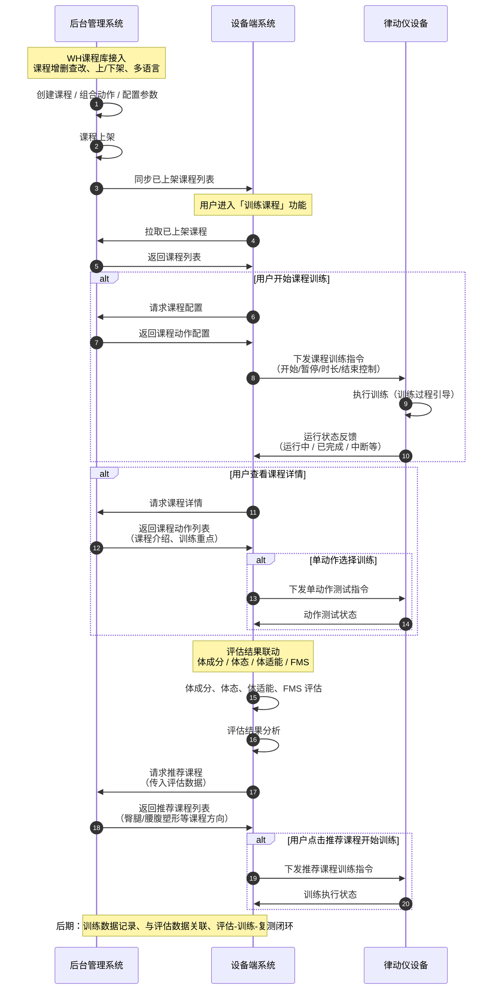

# T5X 接入律动仪 - 修改后流程图

> 本流程图在组员输出流程图基础上，结合《T5X接入律动仪功能清单.xlsx》进行修订，覆盖：设备接入与基础功能、WH 课程库接入、自主训练模式、评估结果联动、智能推荐训练、训练记录与管理。

---

## 一、流程图（Mermaid 序列图）

以下为**修改后的业务流程**，可直接在支持 Mermaid 的编辑器中渲染（如 VS Code + Mermaid 插件、Typora、GitHub 等）。

---

## 二、流程图修订说明

| 修订点 | 说明 |
|--------|------|
| **设备接入与基础功能** | 明确律动仪与主设备接入后，设备端对律动仪具备「开始/暂停/频率/时长/结束」控制，律动仪向设备端反馈「运行中、已完成」等状态。 |
| **WH 课程库接入** | 后台侧体现「课程增删查改、上/下架、多语言」的课程库能力，作为课程列表与课程配置的数据来源。 |
| **自主训练模式** | 覆盖功能清单：课程详情查看（课程介绍、训练重点）、课程一键训练、单动作选择训练、训练过程引导；与流程图中的「请求课程配置/详情」「下发训练指令」「单动作测试」一一对应。 |
| **评估结果联动** | 将「体成分、体态、体适能、FMS」四项评估均纳入流程，与功能清单中「体成分测试联动」「体态评估联动」「体适能评估联动」「FMS 评估联动」一致。 |
| **智能推荐训练** | 评估结果分析后请求推荐课程、返回推荐列表；支持「一键进入推荐训练」即推荐课程可直接下发至律动仪。课程方向（臀腿塑形、腰腹塑形等）在后台推荐逻辑与课程标签中体现。 |
| **训练记录与管理** | 流程图中以注释形式标注「后期：训练数据记录、与评估数据关联、评估-训练-复测闭环」，与功能清单 P2/P3 一致。 |

---

## 三、与功能清单优先级对应

| 功能清单模块 | 流程图对应环节 | 实现优先级 |
|--------------|----------------|------------|
| 设备接入与基础功能 | 下发训练指令、运行状态反馈 | P0 → MVP |
| WH 课程库接入 | 课程创建/上架、同步与拉取课程列表 | P0 → MVP 接口 + 后期完整后台 |
| 自主训练模式 | 课程详情、一键训练、单动作训练、训练引导 | P0 → MVP |
| 评估结果联动 | 体成分/体态/体适能/FMS 评估 → 评估结果分析 | P0/P1 → MVP |
| 智能推荐训练 | 请求推荐课程、返回推荐列表、一键进入推荐训练 | P0/P2 → MVP |
| 训练课程方向 | 课程内容与标签（臀腿/腰腹/HIIT/PHA 等） | P0–P3 → 课程库与推荐算法 |
| 训练记录与管理 | 流程图中标注为后期 | P2/P3 → 后期 |

---

**文档状态**：与《T5X接入律动仪-产品需求文档.md》及功能清单（Excel）对齐，可作为研发与评审依据。
