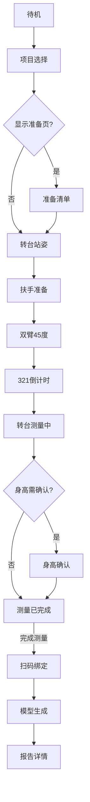

# VAPro7 快速测量与 WellnessHub 配置 PRD

| 属性 | 内容 |
| --- | --- |
| 产品 | Visbody A Pro 7（VAPro7）设备端 + WellnessHub 门店管理后台 |
| 文档版本 | v1.3.9 |
| 变更说明 | v1.3.9：**页面化重组**（§3 Hub 单章 + §4 按屏写全）；「综合测量」改称「快速测量」；转台**始终**采高、后台仅配「身高是否需要确认」；完成页「下一项」并入 §4.10；量产不写语音总开关；**红字**=本次 PRD 变更，**琥珀**=PRD 与现网 Demo 不一致（见附录 C）。旧章对照：原 §5–§9→§4，原 §7→§3，原 §10→§5，原 §11→§6，原 §15→§7，原 §16→§8。相对 v1.3.4 见附录 B。 |
| 依据 | 设备端 Demo（`demo/`）、WellnessHub 测量配置 Demo、[`PRD.md`](./PRD.md) |
| 关联文档 | [`user-flow.md`](./user-flow.md)、[`ui-interaction.md`](./ui-interaction.md)、[`LOCAL-DEMO.md`](./demo/LOCAL-DEMO.md) |

---

## 1. 背景与范围

### 1.1 背景

A Pro 7 门店链路：待机 → 选测量项目 → 引导采集 → 完成决策 → 报告分发。**WellnessHub** 管运行模式、测量项目、报告显隐、首页顺序、体重入口、身高确认策略；**设备** 管引导交互与报告展示。量产设备本地仅保留「显示测量准备页」设置（见 §4.15）。

### 1.2 目标读者与用法

- **研发**：按 §3 对后台字段、按 §4 对每屏实现；附录 A 查内部键名。
- **测试**：按 §4 每页「验收要点」写用例；§7 作回归清单；附录 C 区分「文档要求」与「Demo 现状」。

### 1.3 范围

包含：§3 WellnessHub 测量项目配置、§4 设备端主链路各页、§5 逆向、§6 异常、§7 验收。不含单项测量逐步细节、评审隔离页（附录 A 列文件名）。

---

## 2. 目标用户

| 角色 | 诉求 |
| --- | --- |
| 现场用户 | 低学习成本完成测量，异常有明确纠正 |
| 门店教练 | 引导姿势；可调设备「显示测量准备页」（§4.15） |
| 门店运营 | 在 WellnessHub 配置项目、报告、顺序、按型号+SN 覆盖 |

---

## 3. WellnessHub 测量项目配置

本章为后台**唯一**完整规格；设备端各页仅引用本章条目，不重复展开。

### 3.1 入口与界面

- **路径**：门店管理 → 编辑门店 → **设备配置** → **测量项目/报告配置**（Demo 二级 Tab）。
- **编辑流程**：先改测量项目与报告 → 点「确定」→ 第二步选**生效范围**（该型号门店默认 / 指定 SN）→ 落库（§3.6）。
- **重启提示（必带）**：保存成功须展示语义含「**保存后请重启对应体测设备，配置在设备重启后生效**」（Demo 页头重启提示为参考）。

### 3.2 运行模式（方案 A，废止 B1）

门店每型号**二选一**：**快速模式** 或 **专业模式**。设备首页**仅展示当前模式**下的入口；另一模式配置在后台分桶存档，切换后可编辑。

| 操作（当前模式内） | 结果 |
| --- | --- |
| 快速模式：开启快速测量 | 强制关闭身体成分、体围、体态单项 |
| 专业模式：开启体成分/体态/体围单项 | 快速测量保持关闭 |
| 专业模式：体成分、体态、体围 | 可组合开启（彼此不互斥） |
| 平衡、肩部、颈部 | 不参与上述互斥 |

### 3.3 测量项目与设备首页卡片

| 后台测量项 | 设备首页 | 模式 |
| --- | --- | --- |
| 快速测量 | 「快速测量」 | 仅快速模式 |
| 身体成分（单项） | 「身体成分」 | 仅专业模式 |
| 体态（单项） | 「体态评估」 | 仅专业模式 |
| 体围（单项） | 「体围测量」 | 仅专业模式 |
| 平衡评估 | 「平衡评估」 | 两模式均可 |
| 肩部 / 颈部 | 合并「动态实验室」一张卡 | 两模式均可 |

动态实验室：仅开肩 → 进肩部流程；仅开颈 → 进颈部流程；都开 → 先选部位。首页顺序里「动态实验室」为**整张卡片**位置。

### 3.4 同屏配置项（测量项目列表内）

均在**本 Tab 测量项目列表**中配置，非独立模块：

| 配置项 | 出现位置 | 规则 |
| --- | --- | --- |
| **体重测量** | 项目列表**末行** | 开：项目选择页出现「体重测量」入口；**不进**完成页「下一项」循环 |
| **身高是否需要确认** | **仅专业模式**且**身体成分开启**时，身体成分行**嵌套子项** | 开：转台测量结束后、测量已完成**前**插入身高确认页；关：直接进入测量已完成 |
| **身高采集** | **无单独开关** | 进入转台站姿及后续体成分相关流程时，**始终**在转台阶段采集身高+体重（Toast 提示，流程页不展示读数） |
| **快速模式** | — | **不提供**身高确认配置项；完成页前**不出现**身高确认页 |

**实现差异**：Hub 配置 Demo 保存下发时仍携带「是否启用身高测量」开关，且在专业模式未开启身体成分时会下发为「关」；PRD 口径为进入转台流程即始终采高（附录 C-01）。

### 3.5 报告显隐

快速测量开启时可配：体态、脊柱、臀型、身体成分、**青少年成长**、体围、腰腹维度等报告。身体成分单项可配身体成分报告与青少年成长报告。快速模式与专业模式报告勾选**互不同步**，分桶存储。

### 3.6 首页测量入口顺序

运营可自定义**首页测量入口顺序**；设备完成页「继续下一项」与首页卡片**同一顺序**，在**循环池**内环形应用（规则见 §4.10）。未下发时用设备内置默认顺序。**独立体重不在循环池内**。

### 3.7 生效范围（按型号 + SN）

| 类型 | 含义 |
| --- | --- |
| 该型号 · 门店默认 | 该门店该型号基线；无 SN 覆盖时生效 |
| 该型号 · 指定 SN 覆盖 | 该 SN 整包配置；保存覆盖**不回写**门店默认 |
| 清除覆盖 | 该 SN 回退门店默认（非改字段 diff） |

**量产生效**：保存并成功下发后，设备须**重启**后完整生效。Demo 刷新页面即读本地快照，不模拟重启（§8）。

---

## 4. 设备端页面规格

每页**一次写全**：进入条件、Hub、设备设置、UI、流转、逆向、异常、验收、实现差异。研发/测试**只翻对应小节**。

### 4.0 主链路总览

`身高需确认?` = §3.4 专业模式身体成分嵌套开关；与是否采高无关（转台已采）。

---

#### 4.1 待机页

| 项 | 说明 |
| --- | --- |
| 进入条件 | 设备就绪 |
| WellnessHub | 无单页配置 |
| 设备本地设置 | 无 |
| 内容与操作 | 点击屏幕唤醒 |
| 正向流转 | → 测量项目选择页 |
| 逆向 | — |
| 异常 | 无启用项目时空态文案（§6.4） |
| 验收要点 | 可唤醒；空态文案正确 |
| 实现差异 | 与 Demo 一致 |

---

#### 4.2 测量项目选择页

| 项 | 说明 |
| --- | --- |
| 进入条件 | 自待机唤醒 |
| WellnessHub | §3.3 决定可见卡片；§3.4 体重测量开则显示体重入口；§3.6 决定卡片顺序 |
| 设备本地设置 | 无 |
| 内容与操作 | 展示已启用测量入口；用户点选一项**开启本轮会话**，该项为**循环起点**（§4.10） |
| 正向流转 | 快速测量 → §4.3 或 §4.4（视准备页）；其他项目进对应专项流程 |
| 逆向 | 顶栏 → 待机 |
| 异常 | 无启用项目：「当前未开启任何测量项目，请联系门店工作人员」 |
| 验收要点 | 卡片与 §3 一致；体重入口不进循环；起点记录正确 |
| 实现差异 | 说明书约 60s 无操作回待机：Demo 主链路未实现（附录 C-04）。 |

---

#### 4.3 测量准备清单页

| 项 | 说明 |
| --- | --- |
| 进入条件 | 快速测量且设备「显示测量准备页」开（§4.15） |
| WellnessHub | — |
| 设备本地设置 | **显示测量准备页** 开/关 |
| 内容与操作 | 五项：扎发、赤脚、空腹、避免剧烈运动、**足底对准转台脚印与电极片接触**；确认后进入转台 |
| 正向流转 | → 转台站姿页 |
| 逆向 | 顶栏 → 项目选择 |
| 异常 | — |
| 验收要点 | 关准备页时跳过本页；五项文案完整 |
| 实现差异 | 与 Demo 一致 |

---

#### 4.4 转台站姿页

| 项 | 说明 |
| --- | --- |
| 进入条件 | 快速测量主链路 |
| WellnessHub | §3.4：**始终**转台采高+体重（无关闭身高配置） |
| 设备本地设置 | 准备页开关影响是否经 §4.3 |
| 内容与操作 | 双手自然下垂；站姿识别通过后 Toast：身高/体重进度；**不展示读数** |
| 正向流转 | 识别通过后**自动**进入扶手准备（无「下一步」主按钮） |
| 逆向 | 顶栏 → 准备清单或（跳过准备时宜统一）项目选择 |
| 异常 | 姿态异常见 §6.1 |
| 验收要点 | 始终有身高体重 Toast；自动进扶手 |
| 实现差异 | `shared.js` `deriveHeightMeasurementEnabled()` 仍按快速测量/体成分开关控制是否采高，与 PRD「始终采高」不一致（附录 C-01）。 |

---

#### 4.5 扶手准备页

| 项 | 说明 |
| --- | --- |
| 进入条件 | 转台站姿识别通过 |
| 内容与操作 | 双手与扶手金属区接触；识别通过后播放引导语音 |
| 正向流转 | 语音结束后约 **3 秒自动**进入双臂 45° 页 |
| 逆向 | 顶栏 → 上一引导屏 |
| 验收要点 | 自动推进；金属接触识别 |
| 实现差异 | 与 Demo 一致 |

---

#### 4.6 双臂约 45° 姿势页

| 项 | 说明 |
| --- | --- |
| 内容与操作 | 约 45° 夹角；侧栏保留握持扶手参照 |
| 正向流转 | 姿态识别通过 → 321 倒计时 |
| 逆向 | 顶栏 → 扶手准备 |
| 验收要点 | 识别通过后进入倒计时 |
| 实现差异 | 与 Demo 一致 |

---

#### 4.7 321 倒计时页

| 项 | 说明 |
| --- | --- |
| 正向流转 | 倒计时结束 → 转台测量中 |
| 逆向 | 顶栏 → 双臂 45° |
| 实现差异 | 与 Demo 一致 |

---

#### 4.8 转台测量中页

| 项 | 说明 |
| --- | --- |
| 内容与操作 | 转台旋转采集（约 10s）；姿态/站位异常 §6.1、§6.2 |
| 正向流转 | 结束后：若 §3.4 开启身高确认 → §4.9；否则 → §4.10 |
| 逆向 | 顶栏 → 321 倒计时 |
| 验收要点 | 异常可恢复不强制回首页 |
| 实现差异 | 与 Demo 一致 |

---

#### 4.9 身高确认页

| 项 | 说明 |
| --- | --- |
| 进入条件 | **仅** §3.4 专业模式·身体成分·「身高是否需要确认」开启 |
| 内容与操作 | 查看/微调身高（厘米）；主按钮确认 |
| 正向流转 | 确认或 **20s 无操作自动确认** → 测量已完成页 |
| 逆向 | 顶栏 → 转台测量中 |
| 验收要点 | 快速模式不出现本页 |
| 实现差异 | 与 Demo 一致 |

---

#### 4.10 测量已完成页

全项目（快速测量、专业单项、平衡、动态实验室等）统一本页规格。

| 项 | 说明 |
| --- | --- |
| 进入条件 | 当前测量流程结束（经 §4.9 或跳过） |
| WellnessHub | §3.3 决定「继续下一项」候选；§3.6 决定顺序 |
| 内容与操作 | 摘要（仅刚完成项目相关读数）；**举手识别**后可选：① **完成测量**（主动作）② **继续下一项**（非末项）③ **重新测量当前项目**（弱化，无需下转台） |
| 末项 UI | **本轮最后一项**时：隐藏「继续下一项」；举手引导指向「完成测量」；主动作仅「完成测量」 |

**「下一项」取值与循环（本章唯一完整描述）**

1. **循环池**：当前运行模式下 §3.3 已启用的**常规测量项目**，按 §3.6 **首页测量入口顺序**排列；**不含**独立体重。
2. **起点**：用户在 §4.2 点击的**第一项**。
3. **规则**：从起点起沿顺序**环形**遍历，跳过未启用项与**本轮已测完**项，推荐下一未测项。
4. **末项判定**：当前完成项为「从起点环形一圈后的最后一项待测项」→ 末项。
5. **模式**：快速模式池通常仅「快速测量」一项（测完即末项）；专业模式为已启用单项+专项组合。

**示例**（专业模式，顺序：体成分→体态→体围）：

| 起点 | 本轮顺序 | 末项 |
| --- | --- | --- |
| 体成分 | 体成分→体态→体围 | 体围 |
| 体态 | 体态→体围→体成分 | 体成分 |
| 体围 | 体围→体成分→体态 | 体态 |

**空闲默认**：用户首次点击页或选项后，**20s 无操作** → 非末项自动「继续下一项」；末项自动「完成测量」。

| 正向流转 | 完成测量 → §4.11；继续下一项 → 对应项目入口；重测当前项 → 当前项目首屏（准备或转台） |
| 逆向 | 顶栏 → 转台测量中（量产建议 S3 确认，§5.3） |
| 验收要点 | 环形/末项/体重排除/idle/举手均符合上表 |
| 实现差异 | Demo v1.9.6 已实现环形末项（`sessionCycleStartKey`）；部分专项完成页联调程度见 §8。 |

---

#### 4.11 扫码登录/绑定页

| 项 | 说明 |
| --- | --- |
| 进入条件 | 测量已完成页选「完成测量」 |
| 内容与操作 | 展示报告**二维码**；须完成扫码登录/绑定；**主链路不可跳过**；无 N 秒自动跳过 |
| 正向流转 | 绑定完成 → 模型生成页 |
| 逆向 | 未绑定可回完成页；已绑定成功后退场须 S1（§5.3） |
| 验收要点 | Demo 按钮模拟绑定；量产真实扫码 |
| 实现差异 | S1 模态 Demo 未接（附录 C-03）。 |

---

#### 4.12 人体三维模型生成页

| 项 | 说明 |
| --- | --- |
| 内容与操作 | 「模型生成中」进度 |
| 正向流转 | Demo 约 3s 自动 → 报告详情 |
| 逆向 | 顶栏 → 扫码页；不可回转台测量中 |
| 实现差异 | 与 Demo 一致 |

---

#### 4.13 报告详情页

| 项 | 说明 |
| --- | --- |
| WellnessHub | §3.5 报告显隐 |
| 内容与操作 | 按配置展示报告卡片；**不重复**扫码页同一二维码 |
| 操作 | 「返回首页」→ 项目选择；「重新测量」→ 项目选择（**不清空**本轮会话与绑定） |
| 逆向 | 顶栏 → 测量已完成 |
| 实现差异 | 与 Demo 一致 |

---

#### 4.14 独立体重流程

| 项 | 说明 |
| --- | --- |
| 进入条件 | §3.4 体重测量开；用户在 §4.2 点体重入口 |
| 流程 | 独立测体重 → 体重结果页 → 返回项目选择；**20s** 无操作回项目选择 |
| 与主链路 | 与体成分流程内体重提示分离；**不参与** §4.10 循环 |
| 实现差异 | 说明书约 30s vs Demo 20s 待产品确认（附录 C-06）。 |

---

#### 4.15 设备设置页

| 项 | 说明 |
| --- | --- |
| 入口 | 待机页页脚/顶栏示意 |
| **量产**设备本地项 | **仅「显示测量准备页」**（默认开） |
| 不写回 Hub | 变更影响**下一次**测量 |
| 实现差异 | Demo `settings.html` 仍有「语音播报」开关，量产 PRD 无此项（附录 C-02）。 |

---

## 5. 逆向流程

### 5.1 原则

顶栏「← 返回」为默认；仅 §5.3 **S1/S3** 须模态。各页逆向目标见 §4 对应行。

### 5.2 层级总表

| 当前屏 | 返回目标 |
| --- | --- |
| 项目选择 | 待机 |
| 准备清单 | 项目选择 |
| 转台站姿 | 准备清单或项目选择 |
| 扶手/45°/倒计时 | 上一引导屏 |
| 转台测量中 | 321 倒计时 |
| 身高确认 | 转台测量中 |
| 测量已完成 | 转台测量中 |
| 扫码绑定 | 测量已完成 |
| 模型生成 | 扫码绑定 |
| 报告详情 | 测量已完成 |
| 设备设置 | 待机 |

已进入扫码链后**不可**回到转台测量中（须完成页/报告详情结束会话）。

### 5.3 高风险模态（S1、S3）

| 编号 | 场景 | 安全操作 | 确认继续 |
| --- | --- | --- | --- |
| S1 | 扫码**已绑定**后仍返回 | 留在本页 | 仍要返回 |
| S3 | 完成页返回转台测量中 | 取消 | 返回测量中 |

Demo 顶栏直返，未接 S1/S3（附录 C-03）。

---

## 6. 异常与边界

未在 §4 写明的跨页异常：

### 6.1 姿态异常

触发：准备或测量中姿态失败。主文案「检测到姿态异常，请先调整姿势」。恢复后继续，不强制回首页。

### 6.2 站位偏移

与 6.1 同屏不同文案：「检测到站位偏移，请回到转台中心并保持静止」。

### 6.3 手势不可用

须保留触控/按键完成主路径。

### 6.4 配置空态

无启用项目、后台预览无项目、互斥自动修复（§3.2）等文案见 Demo/§4.2。

### 6.5 报告/网络失败（目标态）

生成超时、上传失败：重试或稍后再看。Demo 仅成功路径（附录 C-05）。

---

## 7. 验收清单

按页/配置勾选，**不复述** §3、§4 规则正文。

| 编号 | 检查点 |
| --- | --- |
| T-3 | §3.2 互斥、§3.4 体重/身高确认、§3.7 重启提示 |
| T-4.2 | 项目选择与 §3 卡片一致 |
| T-4.4 | 转台始终采高+自动进扶手 |
| T-4.9 | 身高确认仅专业体成分可配时出现 |
| T-4.10 | 环形下一项、末项、20s idle、体重不进循环 |
| T-4.11 | 扫码不可跳过 |
| T-4.13 | 报告不显隐与 §3.5 一致；不重复二维码 |
| T-5 | S1/S3（量产或书面豁免） |
| T-6 | 姿态/站位文案可区分 |

---

## 8. Demo 与生产差异

| 项 | Demo（`version.json` **1.9.6**） | 生产目标 |
| --- | --- | --- |
| 配置同步 | 浏览器同源本地存储 | 接口 + SN + 版本号 |
| 配置生效 | 刷新设备页 | **重启设备**（§3.7） |
| 转台/扶手 | 主链路自动推进 | 产品定义 |
| 语音总开关 | `settings.html` 有 `voiceEnabled` | **无**（§4.15） |
| 采高推导 | 随项目开关推导 | **始终采高**（§3.4） |
| S1/S3 | 未接 | 须实现或豁免 |
| 60s 回待机 | 未实现 | 按说明书 |
| 报告失败 UI | 未实现 | 重试/退出 |

---

## 附录 A：研发对照表

正文不出现英文键名；实现查下表与 [`PRD.md`](./PRD.md) §9.1。

| 业务用语 | 内部字段 |
| --- | --- |
| 快速测量 | `comprehensive`（历史键名） |
| 当前运行模式 | `measurementRuntimeMode` |
| 首页测量入口顺序 | `homeMeasurementOrderKeys` |
| 身高是否需要确认 | `heightConfirmRequired` |
| 独立体重 | `weightStandaloneEnabled` |
| 显示测量准备页 | `bodyCompositionPrepEnabled` |
| 本轮循环起点 | `sessionCycleStartKey` |
| 本轮已测完 | `completeGroup` / `completedGroups` |

**Demo 存储键**：`vapro7-demo-state`、`vapro7-measurement-config`、`wellnesshub_measurement_config_demo_v7`。

**页面文件名**：待机 `standby.html`；项目选择 `home.html`；准备 `standard-user-prep.html`；转台 `standard-bodycomp-prep.html`；扶手 `standard-grip-prep.html`；45° `standard-position.html`；倒计时 `standard-countdown.html`；测量中 `standard-measuring.html`；身高确认 `height-confirm.html`；完成 `standard-next-step.html`；扫码 `report-scan-login.html`；生成 `standard-generating.html`；报告 `report-detail.html`；设置 `settings.html`；Hub Demo `wellnesshub-measurement-config-demo.html`。

---

## 附录 B：相对 v1.3.4 修订对照

对照《VAPro7 设备端测量流程需求》v1.3.4。v1.3.9 另做**章节重组**（见文首变更说明）。

| 维度 | v1.3.4 | v1.3.9 |
| --- | --- | --- |
| 文档结构 | 按主题分 §5–§11 | **§3 Hub + §4 按页** |
| 命名 | 综合测量 | **快速测量** |
| 身高 | 设备设置开关；可关采高 | **始终采高**；仅配身高确认 |
| 下一项 | 线性向后 | **环形+末项**（§4.10） |
| 语音 | 设备设置 | **量产无总开关** |
| Hub | 门店+SN | **按型号+SN** |
| 报告 | 6 类 | +青少年成长 |

---

## 附录 C：PRD 与现网 Demo 差异登记表

| 编号 | PRD 章节 | 差异摘要 | 代码位置 | 跟进 |
| --- | --- | --- | --- | --- |
| C-01 | §3.4、§4.4 | PRD：转台始终采高；Demo：`deriveHeightMeasurementEnabled()` 随快速测量/体成分开关 | `demo/shared.js` | 研发对齐 |
| C-02 | §4.15、§8 | PRD：量产无语音总开关；Demo 设置页仍有 `voiceEnabled` | `demo/settings.html`、`shared.js` | Demo 标注或移除 |
| C-03 | §5.3、§4.11 | PRD：S1/S3 模态；Demo 顶栏直返 | 各 HTML 顶栏 | 量产实现 |
| C-04 | §4.2 | PRD：项目选择 60s 回待机；Demo 未实现 | `shared.js` | 产品确认 |
| C-05 | §6.5 | PRD：报告失败 UI；Demo 无 | — | 量产实现 |
| C-06 | §4.14 | 独立体重 idle 20s vs 说明书 30s | Demo 20s | 产品确认 |
| C-07 | §3.4 | Hub 仍下发 `heightMeasurementEnabled` 布尔 | `wellnesshub-measurement-config-demo.html` | 研发/产品 |

---

## PRD 自检

### 待确认

1. 跳过准备页时转台顶栏返回统一回项目选择还是准备清单。
2. 扫码页未完成绑定的阻塞策略与代绑合规。
3. 附录 C 各项优先对齐排期。

*文档结束*
