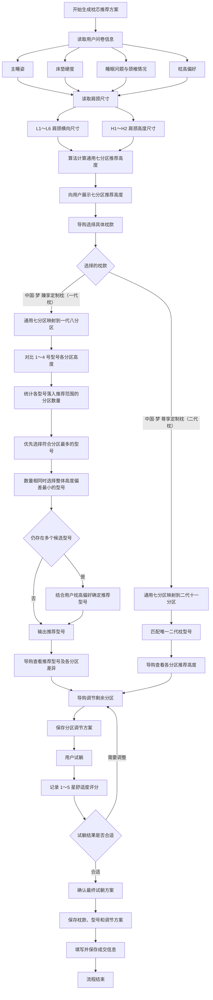

# 一、文档概述
## 1.1 修订记录
| 版号 | 修改日期 | 修改内容 | 修改人 |
| --- | --- | --- | --- |
| v1.0.0    |  |  |  |
|     |     |     |     |
|     |     |     |     |

## 1.2 版本概述
### 版本核心目标
/*按照版本涉及的设备端-具体产品型号、云端-具体云端进行说明，举例如下*/

modudoc：

1. 水星迁移至 wellnesshub 正式环境
2. 分区高度调整从高度调整为垫片数量
3. 设备端更新包兼容
4. 水星导购端成交记录提交功能

### 版本号
/*说明当期每个涉及的设备端-具体产品型号、云端-具体云端的版本号及基于哪个版本进行二次开发，举例如下*/

### 产品兼容说明
> 当涉及到多型号共享代码库时必须填写，不涉及可不填写
>
> 兼容：指对应型号此版本必须兼容，当某些需求对个别型号有特殊要求时，在需求中单独说明。
>
> 不兼容：需说明不兼容的后续处理
>
> 规范及参考链接：
>

[共享代码产品型号库](https://visbodydev.yuque.com/xb25go/xybiw8/he5cep4q3nkwte8s)

[多产品型号代码共享场景下的同步需求管理规范](https://visbodydev.yuque.com/xb25go/xybiw8/uhh8k197hce1nvgz)

### 硬件环境说明
> 当涉及设备端时，必须附上设备端需兼容的硬件环境，举例如下
>

VApro5-S：

<!-- 这是一张图片，ocr 内容为：更新时间 2026年1月13日 (导入3568主板) VAPRO5-S SN:N2(触屏&3568) 版本号 服务 备注说明 模块 操作系统 基本不变 系统 UBUNTU 22.04 AA工具升级则变, V3.4.2-1.21 AA工具+依赖脚本 AA工具 嵌入式管理 跟着版本,运维管理 更新脚本 V1.0.0 脚本 跟着版本,运维管理 打印机脚本 2.3 一般不变,除非固件 有问题,变更时会先 01.23 4279 体脂板固件 走硬件测试,再规划 软件版本,嵌入式管 理 按键板固件 VISBODYFITKEY_2_0 固件和SDK G2I: 相机固件 1.4.42, 1.4.54 一般不变,除非固件 有问题,变更时会先 走硬件测试,再规划 相机SDK G2I:1.10.18 软件版本,算法管理 一般不变,变化时供 BKL_450_4J_V1.0450MM带电极片 转台状态 转台(不带电极片 应链会走变更 45CM转台) 体重固件 01.23 触屏 触屏 00-00-00-00 硬件版本,一般不变 体脂板固件 01.23 硬件 变化时供应链会走 G2L,相机线CTOA 深度相机 变更 3568主板 3568主板 5.10.209 -->

### 关联文档
/*说明对应版本的关联文档，如果每个需求的关联不一样，则此处无需说明，在需求中说明；如为统一的关联文档，像一些客户的定制化需求，则需在此进行说明*/

[https://dan951781659.github.io/visbody-demo/device-report-hub/%E6%B0%B4%E6%98%9F%E5%AE%9A%E5%88%B6%E9%9C%80%E6%B1%82.html?mode=sales&tab=%E7%9D%A1%E7%9C%A0%E9%A1%BE%E9%97%AE](https://dan951781659.github.io/visbody-demo/device-report-hub/%E6%B0%B4%E6%98%9F%E5%AE%9A%E5%88%B6%E9%9C%80%E6%B1%82.html?mode=sales&tab=%E7%9D%A1%E7%9C%A0%E9%A1%BE%E9%97%AE)

### 相关设计
原型设计：链接xxxx

UI设计：链接xxx

### Check List--需求释放前完成（ 产品经理）
| **事项** | **完成状态** |
| --- | --- |
| 多维表建立版本 | - [x] 已完成 |
| 新立项评定流程 [新项目立项评定流程规则](https://visbodydev.yuque.com/xb25go/xybiw8/phyuuov2zomn3w52) |     - [ ] 已提        - [x] 无需提交 |
| 语雀需求文档 | - [x] 已完成 |
| 华为云建立版本 | - [x] 已完成 |

# 二、需求说明
## 业务流程

## 报告整体框架
### 品牌 Banner 修改
<!-- 这是一张图片，ocr 内容为：水星 STARZ HOME 水星睡眠科技AI智配系统 百万级中国睡眠数据XBDA智配算法X维望三维建模,为每个人生成专属睡眠适配方案. -->

见demo：

[https://dan951781659.github.io/visbody-demo/device-report-hub/%E6%B0%B4%E6%98%9F%E5%AE%9A%E5%88%B6%E9%9C%80%E6%B1%82.html?mode=sales&tab=%E7%9D%A1%E7%9C%A0%E9%A1%BE%E9%97%AE](https://dan951781659.github.io/visbody-demo/device-report-hub/%E6%B0%B4%E6%98%9F%E5%AE%9A%E5%88%B6%E9%9C%80%E6%B1%82.html?mode=sales&tab=%E7%9D%A1%E7%9C%A0%E9%A1%BE%E9%97%AE)

### 去掉体态评估入口
### 导购端的内容从原来的 AI 推荐移到table“睡眠顾问模块”
## AI 推荐模块
### 问卷信息
1. 问卷内容为：主睡姿、床垫硬度、睡眠问题和 枕高偏好；

### 肩颈尺寸测量
耳宽、颈宽、肩宽、头背距、颈深、背深、头颈高和头背高增加用户可理解的解释。

| 参数 | 参数定义 | 展开后的最终解释 |
| --- | --- | --- |
| 耳宽 | 两侧耳廓最外侧水平距离 | 反映头部侧面宽度，帮助判断侧睡时耳部和头侧区域所需的接触空间，不用于单独确定枕高。 |
| 颈宽 | 颈部最宽处的水平横向距离 | 帮助判断颈托区域的宽度和受力面积，使颈部获得较均匀的承托，并避免枕头延伸到肩部。 |
| 肩宽 | 左右肩峰点间水平直线距离 | 是判断侧睡头肩间隙的重要参考；还需结合睡姿、床垫软硬和肩部实际下沉情况理解。 |
| 头背距 | 背部后缘至后脑最突出点 | 帮助判断仰睡时头窝深度，以及后脑与颈托之间的高度差，需结合上背部实际下沉情况使用。 |
| 颈深 | 背部后缘至第七颈椎点距离 | 帮助判断颈托凸起高度和承托曲面的深度，反映颈部需要怎样贴合，不等于整只枕头的高度。 |
| 背深 | 背部后缘至肩峰点水平距离 | 帮助理解肩背到头颈的过渡关系，以及枕头肩部避让区域，使肩背能够更自然地贴合。 |
| 头颈高 | 头顶至第七颈椎点垂直高度 | 用于判断头区和颈托区的纵向尺寸与分区位置，反映头颈比例，不能单独换算为枕高。 |
| 头背高 | 头顶至肩峰点垂直高度 | 帮助判断头、颈、肩的整体比例及枕头分区位置，最终仍需结合常用睡姿和实际体验确认。 |

#### 点击交互
解释正文默认隐藏。每张卡片右侧显示展开箭头，点击后只展开当前参数的解释，再次点击收起，不联动其他参数。切换页签后再次进入时恢复默认收起状态。

### 通用 7 分区推荐高度
在肩颈尺寸下方增加通用 7 分区推荐高度，

#### 字段规则
+ 展示七个分区的空间位置、分区编号和推荐高度。
+ 高度为单值时保留一位小数并显示厘米；结果为范围时显示“最小值～最大值厘米”。

#### 异常状态：
+ 数据加载中时显示分区图骨架。
+ 全部结果缺失时显示“推荐高度暂未生成”。
+ 单个分区缺失时保留该分区位置并显示“--”，不能用相邻分区数据填充。

### 颈脊健康分析
1. 文案修改为：头颈姿态、肩背姿态和躯干平衡。具体见 demo；
2. 增加解释内容模块；

#### 组成指标与结论规则
+ 头颈姿态由 颈椎前伸和颈椎侧偏组成。
+ 肩背姿态由 左肩内收度和右肩内收度组成。
+ 躯干平衡由 肩部平衡度和骨盆前移组成。
+ 需求 4 原文当前无法稳定读取，因此本版不补写未经确认的组合条件。以下表格先给出每个正式综合等级对应的设备端文案；待规则原文补齐后，只需在“触发状态或组合条件”列写入正式条件，不改动文案结构。

#### 全状态文案
| 综合维度 | 组成指标 | 触发状态或组合条件 | 综合结论 | 常见原因 | 重点影响 | 建议怎么做 |
| --- | --- | --- | --- | --- | --- | --- |
| 头颈姿态 | 颈椎前伸、颈椎侧偏 | 两项指标组合后的正式结论为正常 | 正常 | 头颈前后位置及左右受力处于常规范围，说明当前姿态和睡眠承托较为平衡。 | 暂未发现需要重点关注的头颈偏移，继续保持即可。 | 保持颈弯贴合和左右均衡承托；日常减少长时间低头，并交替采用仰卧和左右侧卧。 |
| 头颈姿态 | 颈椎前伸、颈椎侧偏 | 两项指标组合后的正式结论为轻度异常 | 轻度异常 | 通常与长期低头、屏幕过低、习惯性前伸或单侧托腮有关；固定单侧睡姿及左右承托不均也可能产生影响。 | 晨起后颈部可能酸胀或一侧更紧，转头不够轻松。 | 仰卧时托住颈弯、让后脑自然落入头窝，侧卧时匹配肩宽并按偏斜方向微调左右高度；日常抬高屏幕，每 45 分钟活动一次。 |
| 头颈姿态 | 颈椎前伸、颈椎侧偏 | 两项指标组合后的正式结论为重度异常 | 重度异常 | 可能与长期低头、固定单侧睡姿及头颈长期偏离自然位置有关，现有承托不足或高度不合适也可能加重不适感。 | 晨起颈部可能明显僵硬、酸重或左右紧张不一，转头和睡醒后的放松感可能受到影响。 | 试躺时重点确认颈弯贴合、头窝深度和左右独立高度，避免继续把头部推向偏移方向；日常减少持续低头和单侧托腮，如持续不适请咨询专业人员。 |
| 肩背姿态 | 左肩内收度、右肩内收度 | 两项指标组合后的正式结论为正常 | 正常 | 双肩自然展开，左右肩部活动和受力处于常规范围。 | 暂未发现明显内扣或单侧肩部受压表现。 | 侧卧时保持肩部有避让、头颈高度与肩宽匹配；日常继续做轻柔扩胸并避免长期单侧负重。 |
| 肩背姿态 | 左肩内收度、右肩内收度 | 两项指标组合后的正式结论为轻度异常 | 轻度异常 | 通常与伏案含胸、长期单侧用鼠或提重物有关；固定侧卧且肩部缺少避让也可能让左右受力不均。 | 异常侧肩峰或肩胛骨内侧可能更易酸胀，侧睡时肩部可能受压。 | 侧卧区应匹配肩宽并保留肩部避让，避免肩部被顶向内扣；日常减少单侧负重，并做门框胸肌拉伸。 |
| 肩背姿态 | 左肩内收度、右肩内收度 | 两项指标组合后的正式结论为重度异常 | 重度异常 | 可能与长期含胸伏案、反复单侧用肩或固定一侧睡眠有关，肩部避让不足也可能让紧张持续。 | 异常侧肩背可能明显酸胀、牵拉，侧睡受压和翻身增多的情况可能更突出。 | 试躺时重点确认左右侧卧高度与肩部避让，避免肩关节持续受压；日常减少单侧负重并进行轻柔扩胸，如持续麻木或活动受限请咨询专业人员。 |
| 躯干平衡 | 肩部平衡度、骨盆前移 | 两项指标组合后的正式结论为正常 | 正常 | 双肩高度和躯干重心处于常规范围，左右承重相对均衡。 | 暂未发现需要重点关注的肩部高度差或骨盆前移表现。 | 保持头颈至上背部自然承托；日常双脚均匀承重，坐姿时让臀部坐满椅面。 |
| 躯干平衡 | 肩部平衡度、骨盆前移 | 两项指标组合后的正式结论为轻度异常 | 轻度异常 | 可能与偏侧承重、单肩背包或久坐时臀部前滑、腰部悬空有关。 | 偏高侧颈肩可能更易发紧，晨起下背部也可能出现轻微酸沉。 | 可根据左右肩颈受力微调分区高度，使头、颈、胸自然延伸；枕头不直接作用于骨盆。日常交替背包、坐满椅面并使用腰靠。 |
| 躯干平衡 | 肩部平衡度、骨盆前移 | 两项指标组合后的正式结论为重度异常 | 重度异常 | 可能与长期偏侧承重、固定单侧用力和久坐塌腰有关，肩部与躯干位置可能形成持续代偿。 | 偏高侧颈肩和下背部可能更易紧张、酸沉，身体左右同时放松的感受可能受到影响。 | 试躺时重点确认左右承托和头颈至上背部的自然延伸；枕头不直接改善骨盆。日常均匀承重、减少久坐，如持续腰背不适请咨询专业人员。 |

## 脊柱评估

结构评分使用同一分级区间：正常为 0～5 分，轻度异常为 6～15 分，中度异常为 16～30 分，重度异常为大于 30 分。分数保留整数，等级由算法返回。

### 脊柱整体结构异常评估

该模块只展示一段综合说明，不拆分“评估结果”和“日常建议”。文案中的 `{分数}` 使用本次脊柱结构综合评分，`{等级}` 使用算法返回的等级。

| 状态 | 分数区间 | 综合说明 |
| --- | --- | --- |
| 正常 | 0～5 分 | 本次脊柱结构综合评分为{分数}分，处于正常区间。评分由颈椎、胸椎和腰椎三部分测量结果综合得出，用于反映本次测量中身体姿态与参考范围的偏离程度；当前整体结果处于常规范围，继续保持良好的坐站姿势和规律活动即可。 |
| 轻度异常 | 6～15 分 | 本次脊柱结构综合评分为{分数}分，处于轻度异常区间。评分由颈椎、胸椎和腰椎三部分测量结果综合得出，用于反映本次测量中身体姿态与参考范围的偏离程度；建议结合各分项结果，关注日常坐站姿势并定期复测。 |
| 中度异常 | 16～30 分 | 本次脊柱结构综合评分为{分数}分，处于中度异常区间。评分由颈椎、胸椎和腰椎三部分测量结果综合得出，用于反映本次测量中身体姿态与参考范围的偏离程度；建议结合各分项结果和自身感受重点关注。 |
| 重度异常 | 大于 30 分 | 本次脊柱结构综合评分为{分数}分，处于重度异常区间。评分由颈椎、胸椎和腰椎三部分测量结果综合得出，用于反映本次测量中身体姿态与参考范围的偏离程度；建议结合各分项结果和自身感受重点关注，如持续出现疼痛、麻木或活动不适，建议咨询专业人员。 |

### 颈椎、胸椎和腰椎结构评估

| 评估模块 | 状态 | 分数区间 | 评估结果 | 日常建议 |
| --- | --- | --- | --- | --- |
| 颈椎结构评估 | 正常 | 0～5 分 | 结合头前倾、头部侧偏及躯干对齐等测量结果，本次评估处于正常区间，提示头颈前后位置及左右平衡处于参考范围。 | 日常继续保持屏幕与视线平齐，避免长时间低头或固定向一侧转头。 |
| 颈椎结构评估 | 轻度异常 | 6～15 分 | 结合头前倾、头部侧偏及躯干对齐等测量结果，本次评估处于轻度异常区间，提示头颈前后位置及左右平衡与参考范围存在轻微偏离。 | 日常注意减少长时间低头和单侧转头，保持屏幕与视线平齐；如持续出现颈肩不适，建议咨询专业人员。 |
| 颈椎结构评估 | 中度异常 | 16～30 分 | 结合头前倾、头部侧偏及躯干对齐等测量结果，本次评估处于中度异常区间，提示头颈前后位置及左右平衡与参考范围存在一定偏离。 | 日常注意减少长时间低头和单侧转头，保持屏幕与视线平齐；如持续出现颈肩疼痛或活动不适，建议咨询专业人员。 |
| 颈椎结构评估 | 重度异常 | 大于 30 分 | 结合头前倾、头部侧偏及躯干对齐等测量结果，本次评估处于重度异常区间，提示头颈前后位置及左右平衡与参考范围偏离较多。 | 日常注意减少长时间低头和单侧转头，保持屏幕与视线平齐；如持续出现颈肩疼痛或活动不适，建议咨询专业人员。 |
| 胸椎结构评估 | 正常 | 0～5 分 | 结合左右肩部高度和躯干前后方向的位置表现，本次评估处于正常区间，提示肩背左右平衡及躯干位置处于参考范围。 | 日常继续保持双肩放松和左右用力均衡，避免长时间含胸、伏案或单侧负重。 |
| 胸椎结构评估 | 轻度异常 | 6～15 分 | 结合左右肩部高度和躯干前后方向的位置表现，本次评估处于轻度异常区间，提示肩背左右平衡及躯干位置与参考范围存在轻微偏离。 | 日常注意双肩放松和左右用力均衡，减少长时间含胸、伏案或单侧负重；建议在相同测量条件下复测观察。 |
| 胸椎结构评估 | 中度异常 | 16～30 分 | 结合左右肩部高度和躯干前后方向的位置表现，本次评估处于中度异常区间，提示肩背左右平衡及躯干位置与参考范围存在一定偏离。 | 日常注意双肩放松和左右用力均衡，减少长时间含胸、伏案或单侧负重；建议在相同测量条件下复测观察。 |
| 胸椎结构评估 | 重度异常 | 大于 30 分 | 结合左右肩部高度和躯干前后方向的位置表现，本次评估处于重度异常区间，提示肩背左右平衡及躯干位置与参考范围偏离较多。 | 日常注意双肩放松和左右用力均衡，减少长时间含胸、伏案或单侧负重；如持续出现肩背不适，建议咨询专业人员。 |
| 腰椎结构评估 | 正常 | 0～5 分 | 结合双腿姿态、膝关节角度及躯干前后和左右方向的位置表现，本次评估处于正常区间，提示腰部整体平衡处于参考范围。 | 日常继续保持坐姿、站姿重心均衡，避免长时间久坐，并适当活动腰背。 |
| 腰椎结构评估 | 轻度异常 | 6～15 分 | 结合双腿姿态、膝关节角度及躯干前后和左右方向的位置表现，本次评估处于轻度异常区间，提示腰部整体平衡与参考范围存在轻微偏离。 | 日常注意减少久坐，保持坐姿、站姿重心均衡，并适当活动腰背；如有持续不适，建议咨询专业人员。 |
| 腰椎结构评估 | 中度异常 | 16～30 分 | 结合双腿姿态、膝关节角度及躯干前后和左右方向的位置表现，本次评估处于中度异常区间，提示腰部整体平衡与参考范围存在一定偏离。 | 日常注意减少久坐，保持坐姿、站姿重心均衡，并适当活动腰背；如有持续不适，建议咨询专业人员。 |
| 腰椎结构评估 | 重度异常 | 大于 30 分 | 结合双腿姿态、膝关节角度及躯干前后和左右方向的位置表现，本次评估处于重度异常区间，提示腰部整体平衡与参考范围偏离较多。 | 日常注意减少久坐，保持坐姿、站姿重心均衡，并适当活动腰背；如持续出现腰背疼痛或活动不适，建议咨询专业人员。 |

分项展开后固定展示：“本结果基于脊柱综合评分模型，用于健康管理参考，不作为疾病诊断；如持续不适，请咨询专业人员。”

## 导购操作

### 枕款选择

页面提供两个枕款选择按钮：

+ **中国·梦 臻享定制枕**，辅助标识为“一代枕”，支持 1～4 号型号匹配。
+ **中国·梦 尊享定制枕**，辅助标识为“二代枕”，只有一个固定型号。

#### 修改内容
1. 新版支持在两款定制枕之间切换。新建方案默认选择“中国·梦 尊享定制枕”；历史方案按已保存的枕款回显，不被默认值覆盖。
2. 两款枕头分别保留自己的型号选择和分区调节草稿，切换枕款后显示所选枕款对应的数据。

#### 操作与交互
1. 点击枕款按钮后，产品图、分区数量、型号选择、基础参数、推荐目标和当前调节数据同步切换。
2. 当前枕款存在未保存调整时，切换前弹框提示：“当前调整尚未保存，是否切换枕款？”确认后放弃当前未保存修改并切换，取消后保留当前枕款和调节内容。

#### 按钮状态
+ 当前选择的枕款按钮高亮，另一枕款按钮保持未选中状态。
+ 枕款参数加载期间，两个枕款按钮均禁用，避免重复切换。
+ 某一枕款的产品参数缺失时，该枕款按钮显示不可用；另一枕款参数正常时仍可点击切换。
+ 当前枕款参数缺失时，不能进入型号匹配或分区调节，并提示“该枕款参数暂未配置”。

### 一代枕型号匹配与人工改选

#### 修改内容
中国·梦 臻享定制枕展示 1～4 号型号及系统推荐结果。导购可以根据用户试躺体验人工改选；推荐选型和最终型号确认合并为一步，不再进行二次型号选择。

#### 推荐规则
1. 将通用七分区推荐高度映射为一代枕八分区目标高度。
2. 对比 1～4 号型号各分区的基础高度，统计每个型号落入推荐范围的分区数量。
3. 优先推荐符合分区数量最多的型号。
4. 符合分区数量相同时，优先选择各分区整体高度偏差最小的型号。
5. 仍存在多个候选型号时，结合问卷中的枕高偏好确定最终推荐型号。

#### 字段规则
+ 展示系统推荐型号、推荐依据摘要和各分区高度差异，不展示内部计算公式。
+ 推荐文案为：“推荐型号：{型号}。该型号与推荐分区匹配度较高，可作为试躺起点；导购可根据用户实际体验改选。”
+ 无法推荐时显示：“推荐型号暂未生成，请先核对测量结果、问卷信息和产品参数。”

#### 操作与交互
点击其他型号后，当前型号立即更新，对应的产品分区、基础高度和调节草稿同步加载。人工改选后以导购选择为当前方案，系统不能自动切回推荐型号。

#### 按钮状态
+ 系统推荐型号显示“推荐”标识，当前选择的型号显示选中状态。
+ 型号参数未加载完成时，全部型号按钮不可点击。
+ 正式推荐规则未配置时不展示推荐标识，但允许导购人工选择已有完整参数的型号。

#### 异常处理
正式型号主数据、分区映射或问卷仲裁规则缺失时，页面显示“系统推荐暂不可用”。产品参数不完整的型号保持禁用，不能进入垫片调节。

### 二代枕型号匹配

中国·梦 尊享定制枕只有一个固定型号。系统将通用七分区推荐高度映射为二代枕十一分区，并自动匹配该型号；页面直接展示各分区推荐高度，不展示型号选择按钮。

二代枕产品参数或十一分区映射缺失时，页面显示“该枕款参数暂未配置”，不能进入垫片调节。

### 分区垫片调节

#### 修改内容
旧版直接修改高度，新版改为导购增减垫片片数，高度和克重随正式换算表自动联动。中国·梦 臻享定制枕显示八个产品分区，中国·梦 尊享定制枕显示十一个产品分区。

#### 字段规则
+ 产品分区图和热点位置以水星正式素材和映射表为准。
+ 当前分区展示名称、基础高度、推荐高度、当前垫片数、调节克重和调节后高度。
+ 垫片数只能输入整数，最小值和最大值由正式参数表提供。
+ 当前 Demo 使用的“每片增加 0.5 厘米、每片 15 克”只是演示数据，量产不能使用。

#### 操作与交互
+ 点击产品图热点后切换当前分区，选中分区高亮。
+ 点击减号减少一片，点击加号增加一片，调节后高度和克重实时更新。
+ 手动输入片数时只接受允许范围内的整数；非法输入不更新调节结果。
+ 点击“重置垫片”恢复进入当前枕款或型号时的回显值，不是全部清零。
+ 点击“保存设置”一次保存全部分区调节结果，保存成功后进入用户试躺环节。

#### 按钮状态
+ 减少到最小值后减号禁用，增加到最大值后加号禁用，并提示“已达到可调范围”。
+ 参数加载中，热点、输入框、加减、重置和保存全部禁用，显示“产品参数加载中…”。
+ 没有未保存修改时，“保存设置”禁用。
+ 保存中按钮显示“保存中…”，所有调节控件禁用，不能重复提交。
+ 保存成功提示“分区设置已保存”；保存失败提示“保存失败，请重试”，并保留当前调节内容。

#### 异常处理
+ 产品分区映射缺失时禁用分区调节，提示“产品参数未配置，请联系管理员”。
+ 垫片换算表缺失时不展示高度和克重，也不允许保存。
+ 保存超时时保留当前调节内容，先查询保存结果，再允许重试，避免重复保存。
+ 方案已被其他终端更新时提示“方案已在其他终端更新，请刷新后重试”，不能静默覆盖。
