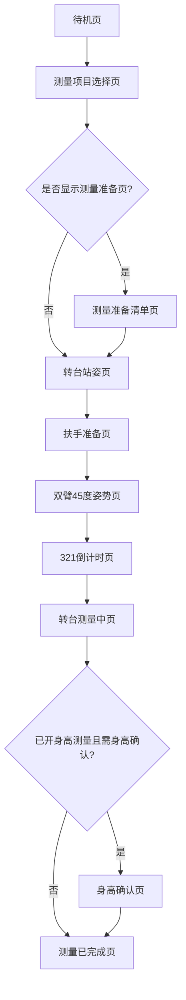
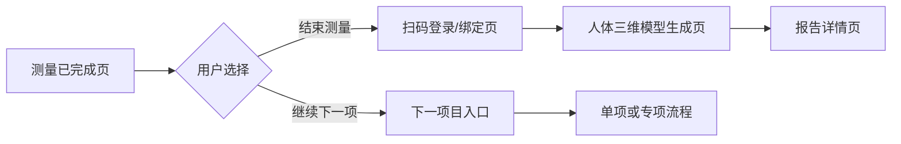
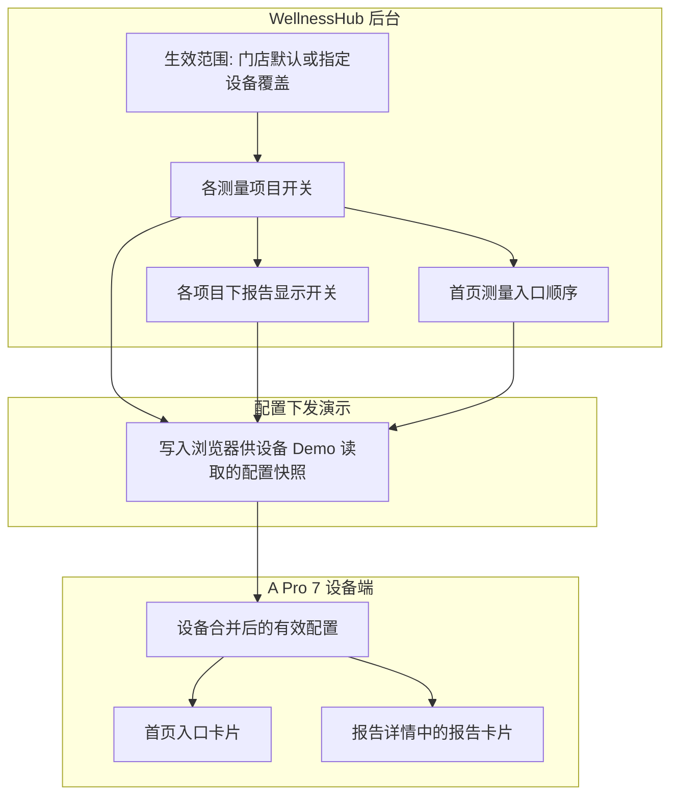
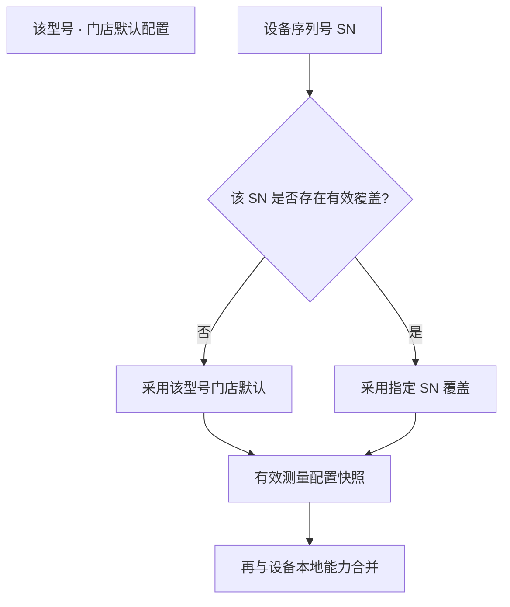
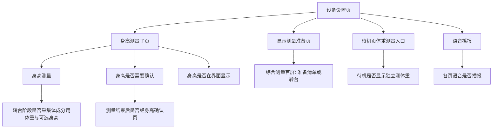
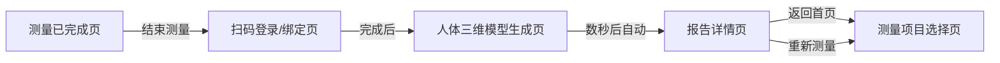
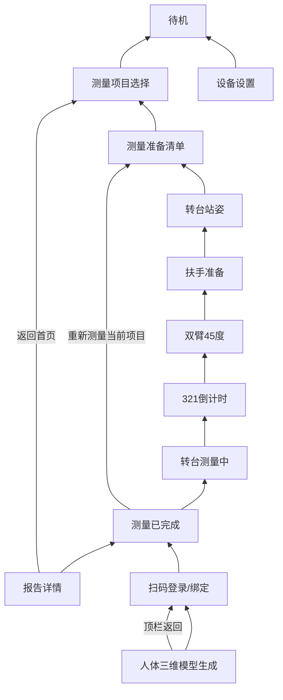
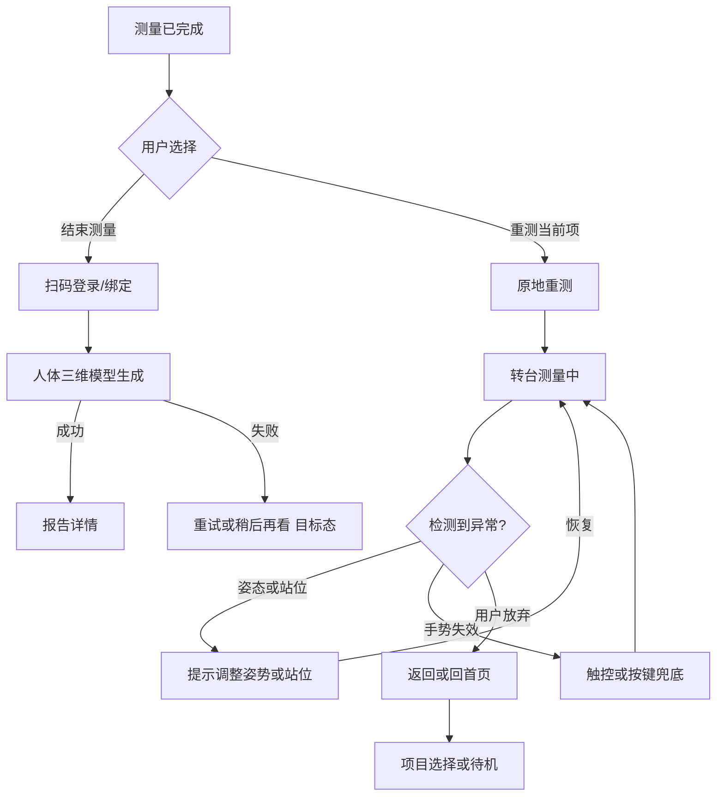
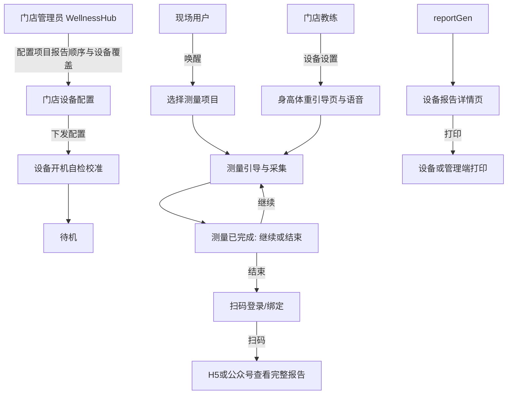

# VAPro7 综合测量与 WellnessHub 配置 PRD

| 属性   | 内容                                                                                                                                                                                                |
| ---- | ------------------------------------------------------------------------------------------------------------------------------------------------------------------------------------------------- |
| 产品   | Visbody A Pro 7（VAPro7）设备端 + WellnessHub 门店管理后台                                                                                                                                                   |
| 文档版本 | v1.3.6                                                                                                                                                                                            |
| 变更说明 | v1.3.5 及以前见历史版本。v1.3.6：对齐 Demo **v1.9.4**——**§5** 综合准备五项、转台自动采高体重并进扶手、扶手语音结束后约 3 秒进 45°、握持示意与参照区；**§7.5** 青少年成长报告与报告聚合展示；**§7.7.2** 清除覆盖无二次确认、量产须重启生效与后台提示；**§7.9 / §15 / §16 / §17 / 附录** 与 WellnessHub Demo v7、设备 Demo 联调入口同步。 |
| 依据   | 设备端 Demo（`demo/` 目录）、WellnessHub 测量配置 Demo（`wellnesshub-measurement-config-demo.html`）、现有 `[PRD.md](./PRD.md)`                                                                                    |
| 关联文档 | `[user-flow.md](./user-flow.md)`、`[ui-interaction.md](./ui-interaction.md)`、`[overall-optimization.md](./overall-optimization.md)`                                                                |

---

## 1. 背景与目标

### 1.1 背景

A Pro 7 是门店现场体测设备，核心体验是一条端到端链路：待机唤醒 → 选择测量项目 → 引导采集 → 完成决策 → 报告生成与分发。测量**项目启用/停用**、**报告显隐**、**首页入口顺序**由 WellnessHub 门店后台统一配置；设备端只消费配置，负责测量引导、结果展示与报告分发。

设备端**身高/体重采集能力**、**测量准备引导页**、**语音播报**等属于设备能力设置，在设备设置页管理，与 WellnessHub 测量项目配置分离。

### 1.2 目标

- 定义综合测量及关联项目的完整正向、逆向与异常流程，供产品、设计、研发、测试对齐。
- 明确 WellnessHub 配置与设备端展示之间的对应关系与互斥规则（含 **B1**：综合可与体态单项并存，综合仍与身体成分/体围单项互斥）。
- 明确设备端设置项对各流程页的控制关系。
- 保证设备端、WellnessHub 后台、手机 H5 对同一测量结果与报告集合的一致性（目标态）。

### 1.3 非目标

- 不定义真实 API、硬件协议、云端报告生成算法细节。
- 不覆盖 Windows App 独立能力（若有，见客户端差异章节扩展）。
- Demo 中以浏览器本地存储模拟配置同步，生产需替换为按设备序列号拉取与版本化下发。

---

## 2. 目标用户

| 角色       | 诉求                                    |
| -------- | ------------------------------------- |
| 现场测量用户   | 低学习成本完成测量，异常时有明确纠正指引                  |
| 门店教练     | 引导用户姿势，必要时调整设备测量能力（身高/引导页等）           |
| 门店运营/管理员 | 在 WellnessHub 配置测量项目、报告显隐、门店默认与单台设备覆盖 |

---

## 3. 范围

### 3.1 包含

- 综合测量完整正向流程（§5）
- 测量项完成后的「下一项」推荐逻辑（§6）
- WellnessHub 配置与设备端展示映射（§7）
- 设备端设置：身高、体重、测量引导页与流程页联动（§8）
- 结束测量 → 报告页链路（§9）
- 逆向流程：返回、退出、原地重测（§10）
- 异常状态及处理流程（§11）
- 整体业务与用户流程图（§12）

### 3.2 不包含

- 单项测量（体态精测、动态实验室、平衡等）逐步交互细节（仅在与综合测量衔接处描述）
- 评审/预览隔离页：触控版完成页、单项占位页、旧版结果方案页（不进入主链路；文件名见附录「Demo 页面对照」）

---

## 4. 术语表

| 术语              | 说明                                                                       |
| --------------- | ------------------------------------------------------------------------ |
| 综合测量            | WellnessHub 中「综合测量」配置项；设备首页对应「综合测量」入口；一轮内包含体成分、体态、体围等采集                  |
| 单项测量            | 身体成分、体态、体围等可单独开启的测量方式；**身体成分、体围**与综合测量互斥；**体态单项**在 B1 规则下可与综合同时开启（详见 §7） |
| 动态实验室           | 肩部、颈部活动度测量；后台可分别开关，设备首页合并为一张「动态实验室」卡片                                    |
| 各报告类型的显示/隐藏     | 后台为每个测量项目配置哪些报告对用户可见；设备报告页按该配置展示或隐藏卡片                                    |
| 首页测量入口的显示顺序     | 仅影响设备首页上各测量入口卡片的排列顺序                                                     |
| 完成页「继续下一项」的推荐顺序 | 决定测量完成后，系统按什么顺序推荐下一项；不由 WellnessHub 直接配置                                 |
| 原地重测            | 用户不下转台，在完成页重新测量当前项目                                                      |
| 设备能力设置          | 身高、待机体重入口、准备页、语音等，仅存于设备侧，WellnessHub 测量配置页不编辑                            |

---

## 5. 综合测量完整流程（正向）

### 5.1 默认前提（与当前 Demo 一致）

- WellnessHub 已开启**综合测量**。
- 设备已开启**显示测量准备页**（综合测量前的五项准备清单，含足底对准转台脚印）。
- 设备**身高测量：默认关闭**（与 Demo 出厂演示一致；若门店需要，可在设备设置中开启）。
- 设备**身高是否需要确认：默认关闭**（含义见 §8.0）。
- 设备**身高是否在界面显示：默认开启**（关闭时界面不展示身高数值，后台仍保存）。

### 5.2 流程总览图

选择「**结束测量**」之后的页面顺序见 **§9**（扫码绑定 → 三维模型生成 → 报告详情），本图仅覆盖到「测量已完成」。

### 5.3 默认配置下的逐步流程（文字）

以下按**默认前提**（身高测量关、身高确认关、显示准备页开）叙述，页面名称为产品用语，与 Demo 中页面一一对应关系见附录。

1. **待机**：用户点击屏幕，进入测量项目选择。
2. **选综合测量**：用户点击「综合测量」，设备开始新一轮测量会话，并清空本轮「各项目是否已测完」的临时记录。
3. **测量准备清单**：展示扎发、赤脚、空腹、避免剧烈运动，以及通栏 **足底对准转台脚印、与电极片充分接触**（共五项）；用户通过手势或点击确认后进入转台站姿。若门店关闭了「显示测量准备页」，则本步跳过，直接进入转台站姿。
4. **转台站姿**：用户站上转台、**双手自然下垂**并保持静止；主视觉为转台站姿示意（`turntable-figure.svg`）。站姿识别通过后，设备以 Toast 依次提示身高/体重采集进度（受「身高测量」开关影响，默认仅体重）；数值进入后台用于体成分计算，**不在流程页展示读数**。采集完成后 **自动进入**扶手准备（Demo：`data-anthropometry-auto`，底部「下一步」不展示）。
5. **扶手准备**：用户双手拇指及四指与扶手金属区充分接触（`hand-grip-metal.svg` 示意）；完成金属接触识别。语音播报结束后约 **3 秒自动进入**双臂姿势页（底栏为说明文案，非主操作按钮）。
6. **双臂约 45°**：用户按图示摆好约 45° 夹角；侧栏保留**握持扶手**参照，与上一步一致。姿态识别通过后进入倒计时。
7. **321 倒计时**：保持姿势，屏幕倒计时。
8. **转台测量中**：转台旋转约 10 秒完成采集；若姿态异常，屏幕与语音提示纠正，恢复后可继续。
9. **测量已完成**：因未开启「身高是否需要确认」，**不经过**身高确认页，直接进入「测量已完成」页。用户可：结束测量并查看报告、按推荐顺序继续下一项、或弱化入口「重新测量当前项目」（无需下转台）。
10. **若选择结束测量**：进入 **扫码登录/绑定** 页（主链路**不可跳过**；Demo 不提供自动跳过）。用户完成扫码并登录后，进入 **人体三维模型生成** 进度页（沿用原「模型生成中」页语义），约数秒后自动进入报告详情。
11. **报告详情**：按后台配置展示可见的报告卡片；**若报告二维码已在扫码页展示并与 H5 为同一枚**，则报告详情页**不再重复**该二维码，避免用户困惑。用户可返回首页、重新测量，或通过既有 H5/公众号入口查看完整报告。

### 5.4 开启「身高测量」时的完整流程

当门店在设备设置中**开启身高测量**，且**仍关闭「身高是否需要确认」**（常见组合）时，与 §5.3 的差异如下：

- **第 4 步（转台站姿）**：在识别通过后，设备依次以简短提示告知「身高测量中 → 身高测量完成 → 体重测量中 → 体重测量完成」，身高与体重数据写入本轮会话，供后续计算与报告使用；仍不在流程页展示读数明细。
- **第 8 步之后**：因未要求「身高确认」，仍**直接进入**「测量已完成」页，不插入身高确认页。
- **报告详情**：若「身高是否在界面显示」为开启，则报告区展示身高相关指标；若为关闭，则界面不展示身高数值，后台仍保存。结束测量支路仍遵循 §9（先扫码绑定，再模型生成，最后报告详情）。

**若同时开启「身高是否需要确认」**：在第 8 步转台测量结束后、进入「测量已完成」**之前**，插入**身高确认页**——用户可查看或微调身高；若 20 秒内无操作，系统自动确认并进入「测量已完成」。

### 5.5 入口与第一页

- 设备首页「综合测量」是否出现，仅由 WellnessHub 是否开启综合测量决定。
- 综合测量的**第一个屏幕**由设备「显示测量准备页」决定：开启则先进准备清单；关闭则直接进入转台站姿。

### 5.6 转台阶段身高与体重（流程内）

- **体重**：综合流程内始终以简短提示告知测量完成；数值用于体成分计算，流程页不展示具体读数。
- **身高**：仅在设备开启「身高测量」时采集；提示顺序见 §5.4。
- 转台识别通过后，默认需用户点击「下一步」再进入扶手环节；联调演示可在地址栏加自动演示参数（详见 Demo 说明文档）。

### 5.7 测量结束后的分支（无代码字段表述）

- 若**已开启身高测量**且**已开启身高是否需要确认**：转台测量结束后 → **身高确认页** → 测量已完成页。
- 其他情况：转台测量结束后 → **直接进入**测量已完成页。

### 5.8 交互通则

- 手势、触控、按键并存；主路径必须有不依赖手势的完成方式。
- 各引导页可提供语音播报（受设备「语音播报」总开关控制）。
- Demo 默认以手动点击推进页面；自动演示模式仅影响转台页等少数环节的自动跳转行为。

---

## 6. 测量完成后的「下一项」逻辑

### 6.1 测量已完成页的主动作

| 选项       | 类型   | 去向                                             |
| -------- | ---- | ---------------------------------------------- |
| 结束测量     | 主动作  | **扫码登录/绑定页** → **人体三维模型生成页** → **报告详情页**（见 §9） |
| 继续下一项测量  | 主动作  | 由系统按推荐顺序计算下一入口                                 |
| 重新测量当前项目 | 弱化动作 | 重新开始本轮综合测量入口；**用户无需下转台**                       |

### 6.2 推荐顺序的规则（产品描述）

系统在设备内维护一份**完成页推荐顺序**（默认顺序为：综合测量 → 体态测量 → 肩部测量等，具体以设备实现为准）。当用户在「测量已完成」页选择「继续下一项」时：

1. 从当前项目起，**只向后**查找下一项，不回到列表开头循环。
2. 跳过未在 WellnessHub 启用的项目，以及本轮已标记为「测完」的项目。
3. 找到第一个可用的，展示为「继续某某测量」并跳转对应入口。
4. 若没有可用下一项，则隐藏「继续下一项」，仅保留「结束测量」。

### 6.3 与 WellnessHub 的关系

| 配置类型                                              | 是否影响完成页「下一项」                            | 是否影响首页卡片 |
| ------------------------------------------------- | --------------------------------------- | -------- |
| 各测量项目是否启用（如平衡、肩部、颈部）                              | 是，决定候选项是否可用                             | 是        |
| **首页测量入口的显示顺序**（`homeMeasurementOrderKeys` 或等价下发） | **是**，与首页卡片使用**同一套顺序**作为完成页「继续下一项」的推荐顺序 | 是，仅排序    |

**重要**：在 WellnessHub 配置了首页入口顺序时，设备端**完成页「继续下一项」的推荐顺序与首页卡片顺序一致**，避免运营在后台调序后首页与完成页推荐不一致。未单独下发首页顺序时，设备使用内置默认顺序（与 Demo `measurementOrderKeys` 预设一致）。

### 6.4 综合测量模式下的典型下一项（路 B + B1）

- **路 B**：用户在综合流程内已采集体态（双手扶杆等），若 WellnessHub **同时开启**「综合测量」与「体态（单项）」，完成页仍可将 **体态专项（双手下垂 / IPose）** 作为「继续下一项」的推荐目标之一（与综合内体态为不同测量姿势/流程，顺序加测）。
- **B1 配置**：综合可与体态单项并存；**不可**与身体成分单项、体围单项同时开启（见 §7.4）。
- 若门店另行开启了平衡或动态实验室等，下一项也可能是对应专项入口。
- **当前 Demo 说明**：综合测量结束后，设备未必自动把「综合测量」记为「本轮已测完」，因此「继续下一项」仍可能再次指向综合测量类入口；量产前需产品确认是否在完成页自动标记「综合测量已完成」。

### 6.5 测量已完成页：空闲自动「继续下一项」（主链路）

主链路 `[standard-next-step.html](./demo/standard-next-step.html)`（手势 + 触控）在量产目标中包含：**用户首次点击页面或任一选项后**，若 **20 秒内无任何操作**，则**自动执行当前默认选项**（与触控预览页一致：一般为「继续下一项测量」）。Demo 已实现该倒计时与自动跳转；纯触控对照页 `[standard-next-step-touch.html](./demo/standard-next-step-touch.html)` 同步为 **20 秒**。

---

## 7. WellnessHub 配置与 A Pro 7 设备展示

### 7.1 配置入口

- **路径**：门店管理 → 编辑门店 → **设备配置** 页签。
- **页内结构（Demo）**：设备配置 Tab 内二级 Tab — **设备样式配置**（Logo/视频、体成分标准、围度 9/14 等门店级项）| **测量项目/报告配置**（按型号配置项目、报告、首页顺序；保存时选生效范围）。详见 [`PRD.md`](./PRD.md) §9.1。
- **演示文件**：WellnessHub 测量配置 Demo（见依据中的 html 文件名）。

### 7.2 配置模型（概念）

### 7.3 后台测量项与设备首页表现

| WellnessHub 测量项（业务名） | 设备端首页典型表现      | 与综合测量的关系                                |
| -------------------- | -------------- | --------------------------------------- |
| 综合测量                 | 「综合测量」入口       | —                                       |
| 身体成分（单项）             | 「身体成分」入口       | 与综合测量互斥                                 |
| 体态（单项）               | 「体态评估」入口       | **可与综合同时开启（B1）**；与身体成分/体围单项的并存关系仍按 §7.4 |
| 体围（单项）               | 「体围测量」入口       | 与综合测量互斥                                 |
| 平衡评估                 | 「平衡评估」入口       | 不与综合测量互斥                                |
| 肩部 / 颈部（动态实验室）       | 合并为一张「动态实验室」入口 | 不与综合测量互斥                                |

后台与设备之间的内部标识对照见附录「研发对照表」。

### 7.4 互斥规则（B1：综合 + 体态可并存）

| 操作            | 结果                                                      |
| ------------- | ------------------------------------------------------- |
| 开启综合测量        | **强制关闭**身体成分、体围两项单项；**体态单项可与综合同时保持开启**（用于路 B：综合后再做体态专项） |
| 开启身体成分单项或体围单项 | **强制关闭**综合测量                                            |
| 开启体态单项        | **不**因「仅开体态」而关闭综合；若已开综合，两者可并存                           |
| 综合关闭时         | 身体成分、体态、体围三项单项可按门店需要组合开启（三项彼此不互斥）                       |
| 平衡、肩部、颈部      | 不参与与综合 / 身体成分 / 体围的上述互斥                                 |

后台界面在冲突时应禁用不可选组合，并提示互斥原因（例如：「综合测量与身体成分（单项）/体围（单项）不能同时开启」）。

### 7.5 综合测量开启时的报告类型（业务名）

综合测量开启时，门店可为以下报告类型分别设置显示或隐藏（默认值以 WellnessHub 为准）：

| 报告类型   | 说明       |
| ------ | -------- |
| 体态报告   | 体态评估结果报告 |
| 脊柱报告   | 脊柱相关分析   |
| 臀型报告   | 臀型相关分析   |
| 身体成分报告 | 体成分数据报告  |
| 体围报告   | 体围维度报告   |
| 腰腹维度报告 | 腰腹围度类报告  |

综合测量关闭、改为单项组合时：分别合并各已开启单项下允许的报告；平衡、肩、颈等专项在其项目启用时再追加对应专项报告。

**重要**：综合测量下的报告勾选与单项模式下的报告勾选**互不同步**；切换模式后各自保留一套配置。

设备报告详情页按「各报告类型的显示/隐藏」隐藏整块卡片。

### 7.6 动态实验室

- 后台在「动态实验室」分组下分别配置肩部、颈部及各自报告。
- 设备端至少开启一项时，首页显示**一张**「动态实验室」卡片。
- 入口：仅开肩部 → 肩部专项准备；仅开颈部 → 颈部专项准备；两项都开 → 先进入肩/颈选择页。
- 设备首页「动态实验室」卡片辅助文案应与入口一致：**仅开肩部**时提示将直接进入肩部专项测量流程；**仅开颈部**时提示将直接进入颈部专项测量流程；**两项均开**时提示进入后需先选择测量部位（Demo 见 `shared.js` `getDynamicLabSubtitle`）。

首页顺序里的「动态实验室」表示**整张卡片**的位置，肩与颈不分开排序。

### 7.7 生效范围

WellnessHub 对同一门店、**同一设备型号**存在**两层**配置来源：**该型号门店默认**（该门店内该型号全部 SN 的基线）与**指定 SN 覆盖**。配置内容（测量项目、报告显隐、首页入口顺序）在编辑区**按型号**维护；运营在保存时通过**第二步「生效范围」**选择写入「该型号门店默认」或「该型号下指定 SN」，避免与配置项混在同一屏。

**型号能力**：不同型号支持的测量项目子集不同（例如部分型号不含平衡、动态实验室等）；后台仅展示当前型号可用的项。详见测量配置 Demo 中的型号目录与 PRD 附录能力矩阵（可随产品迭代调整）。

#### 7.7.1 概念模型

| 类型          | 含义                                                                                                                                                                                                 |
| ----------- | -------------------------------------------------------------------------------------------------------------------------------------------------------------------------------------------------- |
| 该型号 · 门店默认   | 该门店、**该型号**的基线配置；对该门店内该型号下**无有效 SN 覆盖**的设备生效。                                                                                                                                                            |
| 该型号 · 指定 SN 覆盖 | 仅绑定到**所选序列号（且须属于当前型号）**的一份整包配置。产品沟通上按「该 SN 的整包有效配置」理解；**不是**对门店默认作「增量 diff」的叙述。当前静态 Demo 为按型号 + SN **存完整覆盖副本**。若量产采用 diff/补丁模型，由研发在接口契约或附录中单独说明。 |
| 编辑不反向改写门店默认 | 选择「指定设备」并保存时，**只**更新所选 SN（或多台时**各自**）的覆盖内容，**不**回写该型号的门店默认。                                                                                                                                       |

#### 7.7.2 交互与生效规则

| 规则             | 产品含义                                                                                                                      |
| -------------- | ------------------------------------------------------------------------------------------------------------------------- |
| 先配内容、再选范围     | 主屏仅编辑测量项目与报告；点击「确定」后选择**该型号门店默认（全部 SN）**或**指定 SN**，再落库。取消第二步返回主屏不保存本次落库选择。 |
| 设备最终读哪一套       | 该 SN **存在**有效覆盖记录 → 设备采用**覆盖**；否则 → 采用**该 SN 所属型号**的门店默认。解析结果即 §7.8 中的「WellnessHub 下发的测量项目与报告配置」在业务上的**有效快照**。 |
| 修改该型号门店默认     | **不会自动**删除或改写已有 SN 覆盖；已覆盖设备在运营**再次保存该 SN 覆盖**或执行**清除覆盖**（若后台提供）之前，**继续**使用原覆盖内容。                                       |
| 新设备 / 从未覆盖的 SN | 无覆盖记录时，**直接**采用该型号门店默认。                                                                                                      |
| 清除指定覆盖（若后台提供）  | 清除后该 SN **回退**为该型号门店默认；建议「清除覆盖」二次确认。                                                              |
| 多选 SN（后台）      | **保存**覆盖时对勾选列表逐台写入同一套配置快照。量产以接口与权限为准；设备按自身 SN 拉取所属型号配置。                                     |

#### 7.7.3 生效路径（示意）

### 7.8 设备端有效配置的合并顺序（概念）

设备最终采用的有效配置，按大致顺序合并：**设备出厂与本地会话默认值** → **WellnessHub 下发的测量项目与报告配置**（业务上为**已解析门店默认与指定设备覆盖后的有效快照**，见 §7.7.2；覆盖同名业务开关）→ **地址栏调试参数**（用于演示；设备能力类设置在用户已改过后以设备本地为准，避免陈旧书签覆盖）。

### 7.9 本地演示同步（无真实 API）

后台 Demo 在保存或刷新预览时，将一份配置快照写入浏览器存储；设备端 Demo 从该快照读取。同源部署（同一站点）才能联调。具体存储键名见附录「研发对照表」。测量配置 Demo 在保存时通过**弹层选择生效范围**（该型号门店默认 / 该型号指定 SN），用于演示 §7.7；生产目标为「按型号默认 + 按 SN 覆盖 + 按 SN 下发版本化」的等价体验。

---

## 8. 设备端设置与流程页联动

### 8.0 「身高是否需要确认」是什么意思？

这是**身高测量**子设置里的一项，**仅当已开启「身高测量」时才有意义**。

- **关闭（默认）**：用户站在转台时，设备已在转台阶段自动完成身高采集（屏幕用短暂提示告知进度与完成）。整轮综合测量（体成分、体态、体围等）全部结束后，**不再**单独弹出「身高确认」页，直接进入「测量已完成」页，用户可选择结束测量、继续下一项或重新测量当前项。
- **开启**：转台阶段仍会测量身高；但在整轮测量结束、进入「测量已完成」**之前**，多一页「身高确认」——用户可查看身高数值或用加减微调；若 **20 秒内无任何操作**，系统自动确认并进入「测量已完成」。适用于门店希望用户在**全部项目测完后**再核对一次身高的场景。

**注意**：若关闭了「身高测量」，则「身高是否需要确认」不生效；流程不测身高，需要身高的场景（如账号注册）应引导用户手动填写。

### 8.1 原则

身高、待机体重入口、准备页、语音等属于**设备能力**，在设备「设置」及「身高测量」子页中管理，**不在** WellnessHub 测量项目配置 Demo 中编辑。

### 8.2 设置项一览（产品语言）

| 设置项       | 默认值            | 作用说明                              |
| --------- | -------------- | --------------------------------- |
| 身高测量      | 关（与当前 Demo 一致） | 关：转台阶段不测身高，仅体重相关提示；开：转台阶段增加身高采集提示 |
| 身高是否需要确认  | 关              | 见 §8.0；仅当身高测量为开时有效                |
| 身高是否在界面显示 | 开              | 关：身高确认页与报告页不展示身高数字，后台仍保存          |
| 待机页体重测量入口 | 关              | 开：待机页出现独立体重测量入口，与综合流程内体重提示分离      |
| 显示测量准备页   | 开              | 关：综合测量跳过准备清单，直达转台站姿               |
| 语音播报      | 开              | 关：关闭测量引导及相关页面的语音播报                |

设备对上述开关的持久化方式：存于设备 Demo 使用的浏览器本地存储；用户改过后优先于地址栏里的旧参数，避免误覆盖。

### 8.3 各设置对流程的影响（示意）

### 8.4 待机独立体重测量

- 入口：待机页（仅当「待机页体重测量入口」开启）。
- 流程：独立测体重流程 → 独立体重结果页 → 用户立即返回待机。
- 与综合测量流程内的体重提示**分离**，互不影响。

### 8.5 身高确认页（当出现）

- 位于「转台测量中」之后、「测量已完成」**之前**。
- 可输入厘米或微调；主按钮为确认。
- 20 秒无操作自动确认并进入「测量已完成」。

### 8.6 设置页入口

- 待机页脚：长按减号键或点击「设置」进入设备设置。
- 说明书：设置结束后连续快速按两次电源键回首页；Demo 以顶栏返回链路为准。

---

## 9. 结束测量 → 报告页流程

### 9.1 主链路

| 步骤  | 屏幕       | 行为                                                                                                                    |
| --- | -------- | --------------------------------------------------------------------------------------------------------------------- |
| 1   | 测量已完成    | 用户选择「结束测量」（手势或触控）                                                                                                     |
| 2   | 扫码登录/绑定  | 展示与完整报告一致的**二维码**（或等价登录入口）；用户须完成扫码并登录（或门店认可的绑定方式）后方可继续。**主链路不可跳过本页**；Demo 用按钮模拟「已完成扫码并登录」。**无**「未操作 N 秒自动进入下一页」类自动跳过。 |
| 3   | 人体三维模型生成 | 展示「模型生成中」类进度与文案；Demo 约 3 秒后**自动**进入报告详情。顶栏返回回到步骤 2。                                                                   |
| 4   | 报告详情     | 按后台配置展示报告卡片；指标可逐条加载。**不在本页重复展示与步骤 2 相同的报告二维码**（同一枚码已在扫码页完成绑定与分流）。                                                     |
| 5   | 离开       | 「返回首页」或「重新测量」回到测量项目选择                                                                                                 |

> 旧版「扫码结果」独立页若与上述步骤 2 功能重复，不应与主链路并存为第二套扫码。

### 9.2 报告内容规则

- 可见报告集合由 WellnessHub 各项目下的报告显示配置决定（见 §7.5）。
- 体重、综合评分等可在设备端常显；各专项报告受显示/隐藏配置控制。
- 身高区块受「身高是否在界面显示」控制。
- 跨端：用户在 **扫码登录/绑定** 页所扫二维码进入微信或 H5 查看完整报告（与 `user-flow.md` 一致）；报告详情页以大屏阅读为主，**不依赖**二次扫码完成绑定。

### 9.3 与身高确认的时序（文字）

转台测量中 →（若开启身高测量且开启身高是否需要确认）→ **身高确认** → 测量已完成 → **扫码登录/绑定** → 人体三维模型生成 → 报告详情。

### 9.4 打印与 H5

- 设备端：报告列表选中后按电源键打印（说明书）。
- 管理端：网页版打印，电脑与打印机 USB 或云端连接。
- H5：与设备、后台展示同一份测量结果（目标态）。

---

## 10. 逆向流程

> **本章怎么读**  
>
> 1. **默认**：测量过程里用户点顶栏「← 返回」，一般是**直接回到上一页，不弹框**。
> 2. **能回哪**：看 **§10.2**（从当前屏回到哪一屏）和 **§10.3**（哪些阶段**不许**再回到转台测量中）。
> 3. **只有少数高风险**（扫码**已绑定**后仍要离开扫码页、完成页退回转台测量中等）才需要先**弹窗确认**，文案在 **§10.7（S1、S3）**。
> 4. **姿势不对、站偏、手势失灵**等属于 **§11 异常**，不是用户主动「返回」，本章不展开。

### 10.1 原则

每一正向步骤须明确：**可返回层级**、**是否保留会话/站位**、**是否需下转台**。

**常用交互（四条 + 一个例外）**

- **顶栏「← 返回」**：绝大多数测量页的默认逆向方式。  
- **底部大按钮**：如报告详情「返回首页」「重新测量」。  
- **弱化文字链**：如完成页「重新测量当前项目」。  
- **Toast（可选）**：如设置已保存；量产可关。  
- **例外 — 模态二次确认**：仅 **§10.7** 的 **S1、S3**；普通返回不要层层弹窗。

### 10.2 层级返回（顶栏「← 返回」）

| 当前屏幕                  | 返回目标          | 会话/数据                                       |
| --------------------- | ------------- | ------------------------------------------- |
| 测量项目选择                | 待机            | 未开始测量                                       |
| 测量准备清单                | 测量项目选择        | 未进入转台                                       |
| 转台站姿                  | 测量准备清单        | 若门店关闭了准备页，Demo 仍可能回到准备清单，产品宜统一「跳过准备时返回项目选择」 |
| 扶手准备 / 双臂姿势 / 321 倒计时 | 上一引导屏         | 保留站位，可重新识别                                  |
| 转台测量中                 | 321 倒计时       | 本次测量未完成                                     |
| 身高确认                  | 转台测量中         | 身高未确认                                       |
| 测量已完成                 | 转台测量中         | 已采完数据，可重新决策                                 |
| 扫码登录/绑定               | 测量已完成         | 未绑定前可放弃返回完成页（Demo 以顶栏返回为准）                  |
| 人体三维模型生成              | 扫码登录/绑定       | 进度未完成                                       |
| 报告详情                  | 测量已完成         | Demo 顶栏返回至「测量已完成」；报告已生成并展示                  |
| 身高测量子页                | 设备设置          | 设置即时保存                                      |
| 设备设置                  | 待机（或 Demo 总览） | 不强制中断会话逻辑由实现约定                              |

**与高风险模态的对照（详见 §10.7）**：「测量已完成 → 转台测量中」量产建议先走 **S3**；扫码页在**已绑定成功**后顶栏返回建议 **S1**。

### 10.3 退出测量

| 场景                   | 路径                  | 说明                                          |
| -------------------- | ------------------- | ------------------------------------------- |
| 放弃当前项目               | 准备清单逐级返回到测量项目选择再到待机 | 逐级返回                                        |
| 完成页未结束测量             | 返回到转台测量中            | 同一会话                                        |
| 已进入扫码页之后（含模型生成、报告详情） | 不可回到转台测量中           | 须通过报告详情或完成页的回退/回首页结束会话                      |
| 已进入人体三维模型生成          | 不可回到测量中             | 顶栏返回扫码页；不可回到转台                              |
| 报告详情离开               | 「返回首页」→ 测量项目选择      | 结束本次浏览                                      |
| 报告详情重新测量             | 「重新测量」→ 测量项目选择      | 回到项目选择重新选项目；**不清空**本轮会话与已扫码绑定关系；**无**二次确认模态 |

### 10.4 原地重测

来源：`[PRD.md](./PRD.md)` §4.2

- 入口：测量已完成页弱化链接「重新测量当前项目」。
- 行为：重新开始本轮综合测量流程的第一屏（准备清单或转台，取决于「显示测量准备页」）。
- **用户无需下转台**；保留站位，重置本次项目结果。
- 层级：弱化动作，不抢占「结束测量 / 继续下一项」。

### 10.5 设置页逆向

待机 → 设备设置 →（可选）身高测量子页 → 设备设置 → 待机。

设置变更不写回 WellnessHub；影响**下一次**进入测量时的行为。

### 10.6 逆向层级图

上述连线表示**允许返回的层级关系**；实现时：**平常**用顶栏与底部按钮（见 §10.1）；**仅**高风险场景用 **§10.7** 的弹窗，**不**表示每一步都要弹窗。

### 10.7 高风险模态文案（建议稿：S1、S3）

量产可按品牌话术与法务微调；模态为全屏或居中。**安全侧按钮**（取消 / 留在本页）须在说明书与实现中固定，避免误触。

| 编号     | 触发场景                           | 建议标题    | 建议正文                                            | 安全操作     | 确认继续操作    |
| ------ | ------------------------------ | ------- | ----------------------------------------------- | -------- | --------- |
| **S1** | 扫码绑定**已成功**后，用户仍点顶栏「← 返回」离开扫码页 | 确定要返回吗？ | 返回后将中断绑定流程。**已与本次测量关联的账号将解除关联**，若继续结束测量需重新扫码绑定。 | **留在本页** | **仍要返回**  |
| **S3** | **测量已完成**页顶栏返回「转台测量中」          | 返回测量中？  | 将回到转台测量；**完成页选项状态将失效**；已落库数据不受影响（与接口不一致时以接口为准）。 | **取消**   | **返回测量中** |

**与 §11 的分工**：姿态异常、站位偏移、手势失灵等走 **§11** 页内纠正，**不**用本章 S1、S3。

**Demo**：当前静态页多为顶栏直返、**未接** S1、S3 模态；量产须按上表补齐或书面豁免。

---

## 11. 异常状态及处理流程

### 11.1 测量过程姿态异常

| 维度  | 说明                                       |
| --- | ---------------------------------------- |
| 触发  | 准备或测量中姿态识别失败；Demo 可用地址栏「姿势异常演示」类参数       |
| 反馈  | 文案「检测到姿态异常，请先调整姿势」；状态标签；语音播报在「语音播报」开启时播放 |
| 恢复  | 调整至正确姿态后继续；**不强制回首页**                    |
| 中断  | 测量进度可被打断，恢复后继续                           |

### 11.2 用户移动 / 站位偏移

与 §11.1 **共用同一套纠正界面**（状态区、主副文案、语音），以下为**量产建议区分文案**（可按品牌话术微调）：

| 维度          | §11.1 姿态异常         | §11.2 站位偏移                 |
| ----------- | ------------------ | -------------------------- |
| 触发          | 准备或测量中姿态识别失败       | 测量中检测到用户站位偏离有效测量区          |
| 屏幕主文案       | 检测到姿态异常，请先调整姿势     | 检测到站位偏移，请回到转台中心并保持静止       |
| 状态标签 / chip | 姿势异常               | 站位偏移                       |
| 副文案或图示引导    | 请按图示调整身体姿势         | 请勿离开转台有效测量区域               |
| 语音播报（开启时）   | 与主文案一致             | 与主文案一致（句式与 11.1 区分，避免用户混淆） |
| 恢复          | 姿态正确后继续；**不强制回首页** | 回到可测区域后继续；**不强制回首页**       |
| 中断          | 测量进度可被打断，恢复后继续     | 同左                         |

### 11.3 手势识别不可用

| 维度  | 说明                  |
| --- | ------------------- |
| 触发  | 光线不足、用户关闭手势识别       |
| 反馈  | 环境光线提醒（说明书）；设置中可关手势 |
| 兜底  | 触控点击各步按钮；按键按按键指引    |
| 要求  | 主路径必须有非手势完成方式       |

### 11.4 报告生成 / 打开失败

| 维度   | 说明                 |
| ---- | ------------------ |
| 触发   | 生成超时、报告未生成、外链失败    |
| 目标态  | 「返回重试」「稍后再看」；保留回首页 |
| Demo | 仅成功路径；**无失败界面**    |

### 11.5 配置与入口空态

| 场景        | 设备表现                                           |
| --------- | ---------------------------------------------- |
| 未启用任何测量项目 | 测量项目选择与待机：「当前未开启任何测量项目，请联系门店工作人员」              |
| 后台预览无项目   | 「请至少开启一项测量项目」                                  |
| 互斥冲突      | 后台与设备侧逻辑自动修复为合法组合（B1：综合可与体态并存，综合不与身体成分/体围单项并存） |

### 11.6 会话与顺序异常

| 场景               | 处理                                      |
| ---------------- | --------------------------------------- |
| 无可用「下一项」         | 隐藏「继续下一项」，仅「结束测量」                       |
| 本轮「综合测量已测完」未自动标记 | Demo 可能重复推荐；量产需确认标记时机                   |
| 首页与完成页推荐顺序       | 与 **§6.3** 一致：有首页顺序下发时，二者同源；无下发时用设备默认顺序 |

### 11.7 设备能力相关

| 场景      | 行为                      |
| ------- | ----------------------- |
| 身高测量关闭  | 无身高采集提示；需手填身高的场景由账号流程承担 |
| 身高确认无操作 | 20 秒自动确认 → 测量已完成        |

### 11.8 超时与空闲

| 场景         | 产品规格                                       | Demo                                           |
| ---------- | ------------------------------------------ | ---------------------------------------------- |
| 项目选择页无操作   | 约 60 秒回待机（见 `ui-interaction.md`）           | 主链路**未实现**                                     |
| 完成页空闲自动下一项 | 首次点击后开始 **20 秒**无操作，默认进入「继续下一项」（与 §6.5 一致） | **主链路已实现**（`standard-next-step.html`）；触控对照页同秒数 |
| 身高确认无操作    | 20 秒自动确认                                   | **已实现**                                        |

### 11.9 网络异常

- 设备设置含网络诊断与网络设置入口。
- 配置下发失败、报告上传失败：目标态为重试、离线提示或联系工作人员；Demo 不模拟。

### 11.10 异常处理总览

---

## 12. 整体业务及用户使用流程

### 12.1 端到端业务流（多角色）

### 12.2 用户现场操作流

**默认（身高测量关、身高确认关）**：与 §5.3 一致——待机 → 选综合测量 → 准备清单（可跳过）→ 转台（仅体重提示）→ 扶手 → 45° → 倒计时 → 测量中 → 测量已完成 →（可选）下一项循环 → 结束测量 → **扫码绑定** → **三维模型生成** → 报告详情 → 离开。

**开启身高测量且仍关闭身高确认**：与 §5.4 前半一致——转台阶段增加身高提示，仍不经身高确认页。

**同时开启身高测量与身高确认**：在「测量已完成」前插入身高确认（§5.4 末段）。

异常见 §11，逆向见 §10。

---

## 13. 用户故事

1. **作为**现场用户，**我希望**从待机一键进入已启用的综合测量，**以便**快速完成首次到店体测。
2. **作为**现场用户，**我希望**姿态错误时有语音和屏幕提示，**以便**调整后继续而不用重头开始。
3. **作为**现场用户，**我希望**综合测量完成后选择继续测体态专项（路 B）、肩/平衡或结束看报告，**以便**一次到店完成多项评估。
4. **作为**现场用户，**我希望**不下转台即可重测当前项目，**以便**纠正失误后立即重采。
5. **作为**门店教练，**我希望**在设备设置中开关身高测量与准备引导页，**以便**适配不同门店流程。
6. **作为**门店管理员，**我希望**在 WellnessHub 统一配置项目与报告显隐，**以便**设备端与 H5 展示一致。
7. **作为**门店管理员，**我希望**为特定序列号设备覆盖配置，**以便**同一门店内不同设备可有差异策略。

---

## 14. 非功能需求

- 多输入冗余：手势 + 触控 + 按键，主路径不依赖单一输入方式。  
- 语音可通过设备设置全局关闭。  
- 减动效：系统「减少动态效果」开启时，测量动画与音效应适配。  
- 配置一致性：WellnessHub、设备端、H5 同项目同报告集合（目标态）。  
- 设备能力类设置在用户已修改后，优先于地址栏旧参数，防止陈旧书签覆盖用户选择。

---

## 15. 验收标准

### 15.1 正向流程

- 默认配置下综合测量可走通：待机 → 项目选择 → 准备清单 → 转台 → 扶手 → 姿势 → 倒计时 → 测量中 → 测量已完成 → **扫码登录/绑定** → **人体三维模型生成** → 报告详情。  
- 「结束测量」主链路**不可跳过**扫码登录/绑定页；Demo 无「未操作自动跳过」该页。  
- 报告详情页**不**重复展示与扫码页相同的报告二维码（与产品约定一致时）。
- 关闭「显示测量准备页」时，综合测量跳过准备清单直达转台站姿。  
- 开启「身高测量」且开启「身高是否需要确认」时，测量中之后、测量已完成之前出现身高确认页。

### 15.2 下一项与结束

- 测量已完成页可区分「结束测量 / 继续下一项 / 重新测量当前项目」层级。  
- 「继续下一项」按推荐顺序向后查找，跳过未启用项（顺序与首页一致，见 §6.3）。  
- 测量已完成页：首次点击后 **20 秒**无操作自动进入默认「继续下一项」（与 §6.5、§11.8 一致）。  
- 无下一项时隐藏「继续下一项」。

### 15.3 WellnessHub 配置

- 关闭项目后设备首页不显示对应入口。  
- **B1**：综合测量可与体态单项同时开启；综合与身体成分单项、体围单项仍互斥；后台与设备 Demo 行为一致。  
- 报告显隐与后台各报告开关一致。  
- **首页入口顺序**调整后，完成页「继续下一项」推荐顺序与首页卡片顺序**一致**（见 §6.3）。

### 15.4 设备设置

- 身高、待机体重入口、准备页、语音开关变更后，下一次测量行为符合 §8。  
- 设备能力类设置在用户已保存后，不被陈旧地址栏参数单独覆盖。

### 15.5 逆向与异常

- **站位偏移**与**姿态异常**的提示文案可区分（见 §11.2），恢复后均不强制回首页。
- 关闭手势后全流程可仅用触控完成。  
- 无启用项目时待机与项目选择有空态文案。  
- 原地重测不要求用户下转台。  
- 报告生成失败有重试或退出路径（目标态；可与 Demo 分期验收）。

---

## 16. Demo 与生产差异

| 项               | Demo                              | 生产目标                    |
| --------------- | --------------------------------- | ----------------------- |
| 配置同步            | 浏览器本地存储同源联调                       | 接口 + 按序列号拉取 + 版本号       |
| 换页              | 默认手动；演示模式部分自动                     | 由产品定义自动或半自动策略           |
| 综合测量完成后的「已测完」标记 | 未必自动写入                            | 待产品确认                   |
| 60 秒无操作回待机      | 主链路未实现                            | 按说明书实现                  |
| 报告失败界面          | 未实现                               | 重试或稍后再看                 |
| 测量顺序编辑界面        | 已从设备设置主列表移除                       | 待定义配置入口                 |
| 隔离预览页           | 存在但不进主链路                          | 不应作为正式用户路径              |
| 结束测量支路          | **扫码页 → 模型生成 → 报告详情**；报告详情不重复主二维码 | 与门店网络、账号体系对接后的真实扫码与登录策略 |
| 综合 + 体态配置       | **B1**：可同时开启；完成页可出现体态专项「下一项」      | 与后台策略一致                 |
| 完成页空闲自动下一项      | 主链路 **20 秒**（首次点击后）               | 与说明书一致                  |

---

## 17. 后台下发内容（产品清单，无代码结构）

WellnessHub 下发给设备侧的配置快照，在业务上至少应包含：

- 综合测量是否开启；各单项测量是否开启。  
- 各报告类型是否对用户显示。  
- 平衡、肩部、颈部等专项是否开启及对应报告显示。  
- 可选：**首页测量入口的自定义排序**（与完成页「下一项」同源，见 §6.3）；未下发时设备使用默认顺序。

内部字段名与 JSON 结构仅供研发联调，见附录。

---

## 附录 A：研发对照表（字段与页面文件名）

以下内容**供研发与 Demo 对照**，产品正文以业务用语为准。

**WellnessHub 项目标识与设备内部开关（节选）**：综合测量 `comprehensive`；身体成分单项 `bodyComp`；体态单项 `posture`；体围单项 `circumference`；平衡 `balance`；肩 `shoulder`；颈 `neck`。设备首页「综合测量」对应内部综合开关；动态实验室对应肩、颈开关的合并展示。

**浏览器存储键（Demo）**：设备会话与能力见设备 Demo 状态键；后台写入、设备读取的测量配置见测量配置键（与 `PRD.md` §9.1 表格一致）。

**Demo 页面对照（文件名）**：待机 `standby.html`；项目选择 `home.html`；准备清单 `standard-user-prep.html`；转台站姿 `standard-bodycomp-prep.html`；扶手 `standard-grip-prep.html`；姿势 `standard-position.html`；倒计时 `standard-countdown.html`；测量中 `standard-measuring.html`；身高确认 `height-confirm.html`；测量已完成 `standard-next-step.html`；**扫码登录/绑定** `report-scan-login.html`；人体三维模型生成 `standard-generating.html`；报告详情 `report-detail.html`；设备设置 `settings.html`；身高子页 `settings-height.html`。评审用触控完成页、单项占位页、旧版结果方案页不列入主链路。

---

## PRD 自检

### 缺失信息

1. 量产环境完成页「下一项」顺序与 WellnessHub **首页入口顺序**的同步策略（无首页顺序下发时的默认规则）。
2. 综合测量完成后是否自动标记「本轮综合测量已测完」。
3. 跳过准备清单时，从转台站姿顶栏返回应回到「项目选择」还是「准备清单」的产品统一规则。
4. 报告生成失败、网络中断等异常界面与文案。
5. 全链路接口契约（序列号拉取、配置版本、冲突合并策略）。

### 风险与依赖

- 三端一致依赖 WellnessHub 下发与设备离线缓存策略。  
- 手势受环境影响，须保证触控与按键兜底全链路覆盖。  
- 浏览器本地存储联调不能替代多设备序列号覆盖验收。  
- 旧版扫码结果页等若误接入主流程会导致体验分叉。

### 待确认问题

1. 项目选择页 60 秒无操作回待机是否在下一版设备端强制实现？
2. 报告详情「重新测量」回首页时，是否需在 UI 上增加**非模态**提示语（已明确**不清空**本轮会话与绑定，见 §10.3）。
3. 独立体重测量超时回待机：说明书约 30 秒与 Demo「立即返回」以何为准？
4. 若产品决定将「身高测量」默认改为开启，需同步更新 Demo 默认值与 `[PRD.md](./PRD.md)` §11 表格，并更新本文 §5.1、§8.2 默认值描述。
5. 扫码登录/绑定页：用户**未完成**扫码时的阻塞时长、是否允许工作人员代绑、与隐私合规的最终策略。
6. **§10.7 S1、S3** 与法务/说明书是否一致。

*文档结束*