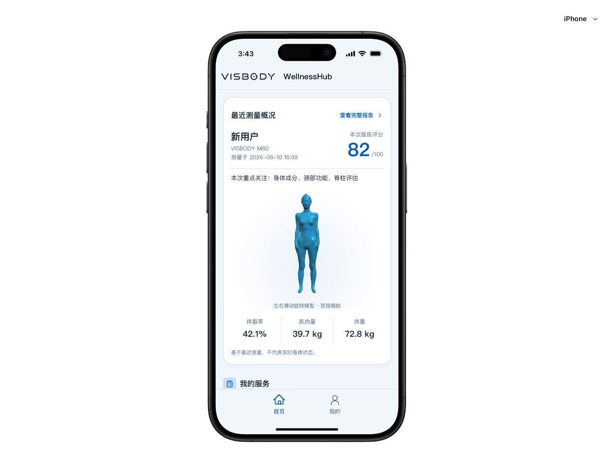
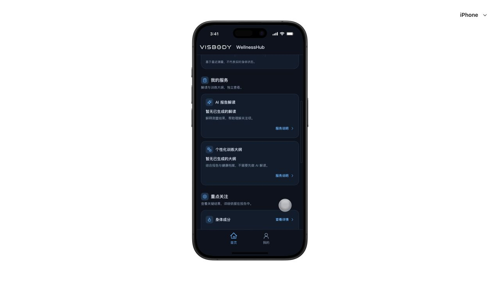
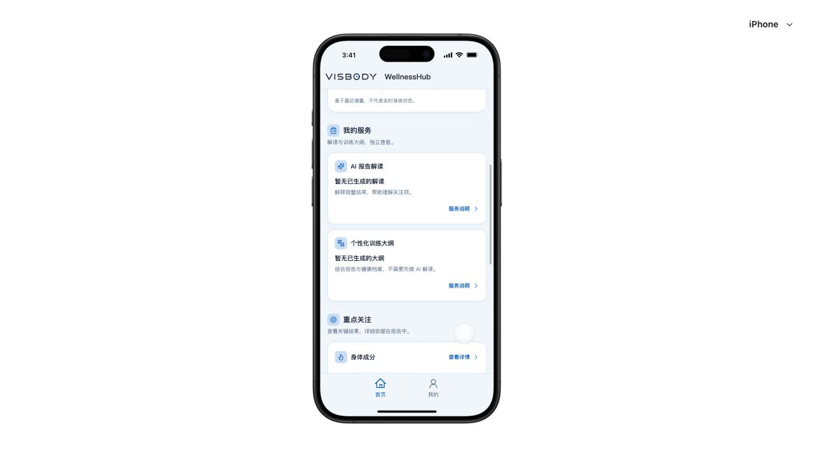
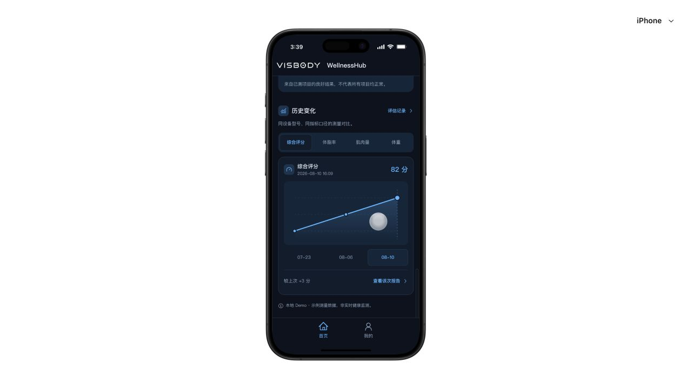
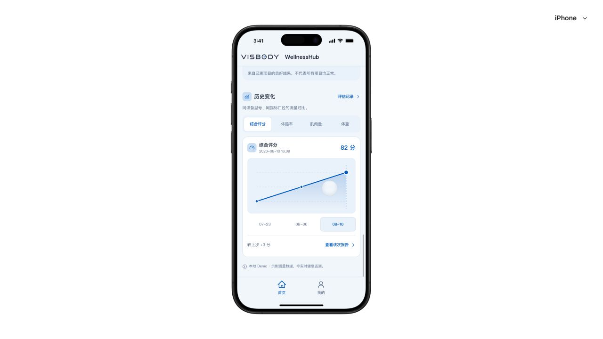

# WellnessHub H5 Design QA

## v0.2.3 登录页底部按钮重排 — 2026-09-17

### 目标

- 游客体验上提至登录按钮正下方，作为全宽 Secondary CTA，提高可发现性
- 创建新账号降为「还没有账号？创建新账号」文本链接
- … / Google / Facebook / 更多方式统一归入「其他登录方式」同区；**图标圆形按钮横排**，避免全宽竖排占高

### 已完成

- `Auth` DOM：`guest-cta` → `auth-register-row` → `auth-alt-block`（圆形 icon 按钮：Google / Facebook / mode 第三项）
- 删除独立 `AccountChannelSwitch` 与底部孤立「…」方块
- i18n 新增 `noAccount`（zh / en / de / ar）
- CSS：`.guest-cta`、`.auth-register-row`、`.auth-text-link`、`.auth-alt-icons`、`.alt-icon-btn`

### 验收清单

1. 登录下方立即可见「游客体验」全宽 CTA（标题 + 副文案 + chevron）
2. 「创建新账号」为文本链，不再占全宽 secondary
3. 「其他登录方式」下 Google / Facebook / 更多或邮箱验证码同区同宽
4. emailCode / emailPassword / phoneCode / phonePassword 四种 mode 结构正确
5. light ↔ dark 形态一致；BottomSheet 仍可打开
6. `npm run check:runtime` + `npm run build`：通过

## v0.2.2 登录整改 — 2026-09-17

实现完成，流程实点通过；未标记全站正式交付。

- 完整实点：邮箱验证码 → 邮箱密码 → 省略号 → 弹层手机号密码 → 手机验证码 → 醒目邮箱返回。弹层退出动画期间需等待退出后操作下一控件。
- 邮箱／手机号密码的忘记密码固定在逻辑末端；更多不再占用表单辅助行。手机号两页返回邮箱使用同一结构、同一位置。
- 窄屏检查覆盖320、375、390、393、423、427px、四语言与深浅主题，未观察到横向溢出；德语允许换行。Pixel 阿拉伯语主题截图检查完成。批量检查存在即时读取旧模式的时序问题，因此不作为四模式全矩阵验收证据；完整路径另行逐状态等待并确认。
- 最新源码预览 Logo naturalWidth=177，生产构建输出带哈希图片资源；加载失败使用文字，不显示浏览器破图。
- TypeScript、首页数据19项、运行时28文件、生产构建、Sites打包4项通过；既有大包警告保留。
- 未完成：真机键盘、屏幕阅读器、所有设备／模式完整截图视觉验收、第三方真实OAuth与真实短信。前端Mock和数据结构未改变。
- 执行前原工程与v0.2.1快照一致；v0.2.2独立快照用于回退，未修改童允强版本。

## Final result

`passed — v0.2.1 homepage scope` — 2026-09-14。仅代表本期原版首页服务状态、隔离预览、图标与模型交互检查通过，不代表全站生产交付、真实支付或 AI 生成已上线。以下旧版全站待验收项仍保留。

## v0.2.1 本期检查

- 四个预览入口均可直接打开和刷新：均未生成、仅 AI、仅训练、均已生成；服务状态完全独立。
- 预览显示固定示例用户，隔离测试确认预览组件不访问报告、身体档案、服务结果或会话存储；未知场景显示错误，不回退个人首页。AI 与训练详情为只读，未出现邮件、删除、编辑或训练打卡入口。
- 首页移除固定品牌栏并保留状态区实色遮挡；正常首页与预览页均从安全区下方开始。iPhone 与 Pixel 中导航底边与应用底边一致，内容保留导航间距。
- 图标语义：AI／脊柱为紫色，训练／良好表现为绿色，重点关注／体脂为橙色，历史／颈部／平衡为青蓝色，体围／评分／体重为品牌蓝。浅色 Token 已提高对比度。
- 模型控制实点通过：暂停后入口切换为“继续自动旋转”，恢复后切回“暂停自动旋转”；两次间隔画面采样发生变化。代码同时覆盖交互后 3 秒恢复、离屏／标签隐藏暂停和减少动态效果默认静止。
- 布局矩阵：320、375、390、393、423、427px × 中文／英文／德语／阿拉伯语 × 深浅主题，共 48 组；无横向溢出、RTL 错位、品牌栏残留、服务卡或旋转控件缺失。
- `npm run test:home`：19/19；`npm run check:runtime`：28 个受保护文件通过；`npm run build`：通过；`npm run test:sites`：4/4。构建仍有既存 500kB 以上 JS chunk 警告。

## v0.2.0 本期检查

- 首页顺序：最近测量概况 → 我的服务 → 重点关注 → 历史变化。3D 在第一屏，模型和数据绑定同一测量；历史模型缺失时不串用最新模型。
- 数据测试 `npm run test:home`：16/16，包括乱序、真实日期、删除／空报告、单次、缺指标、零值、不同口径、优先级、模型归属、两服务独立与历史关联。
- 布局矩阵：320、375、390、393、423、427px × 中文／英文／德语／阿拉伯语 × 深浅主题，共 48 组，检查实际宽度、RTL、主要文本／按钮溢出和服务卡数；未发现横向溢出。矩阵结果保存在 `qa/home-v0.2.0/responsive-results.json`。
- 11 类服务／数据场景：均无、仅 AI、仅训练、均有、仅历史、无报告、单次、缺模型／指标、不同设备、未关联内容、读取失败。保存在 `qa/home-v0.2.0/scenario-results.json`。
- 实际点击：完整报告、三项关注、良好表现展开／收起、平衡与体围、历史 AI 与历史训练、趋势指标／日期／键盘 Home、选中日期的报告、评估记录和返回路径。历史结果使用原报告 ID 及内容 ID，不显示最新报告的内容。
- 服务说明：底部弹层解释用途与边界，背景进入模态状态，可关闭；无购买或生成按钮。
- 删除：隔离测试中取消后仍有 3 条；确认删除最新记录后，首页变为 08-06 的 79 分，趋势同步减少；离开测试入口进入普通应用并刷新后仍为 79 分，未恢复种子报告。
- 档案与单位：测试档案手填体重为 999kg，但首页显示报告 72.8kg；英制为 160.5lb、肌肉量 87.5lb，体脂率保持 42.1%。四语言显示与主题不改变原始数值。
- 缺少全部模块时，完整报告显示“暂无数据”；无生成内容不显示已生成。已修复缺失数据被解读成无异常、深色服务摘要继承灰字两处问题。
- iPhone 与 Pixel 预览检查：真实滚动下固定品牌栏／状态区无穿透，页尾操作在导航上方；模型旋转／缩放交互保留。截图查看见下方。
- 控制台：原版预览未记录 error/warn。隔离测试入口热更新曾出现重复 createRoot 提示，已补充 dispose 清理并刷新验证；未改动手机运行时。
- `npm run check:runtime`：28 个受保护文件通过；`npm run build`：通过；`npm run test:sites`：4/4（仅静态打包测试，未部署）。
- 基线独立恢复：从 v0.1.0 快照复制、重新安装依赖，运行时与构建均通过；详见 `ROLLBACK.md`。

### 截图证据

### 本期限制

- 手机为保留的模拟运行时，未进行真机硬件、真实多指手势或屏幕阅读器全套验收。
- 既有详情页未全量整改。例如脊柱模块内仍有旧版重复的训练说明文案；本期只验证来源报告和模块定位，不据此宣称七模块全量通过。
- 现存 JS 大包构建警告仍在（基线也存在）；未做首包性能优化。
- 本地无可靠服务关联时默认显示暂无结果；样例不是个人生成结果。支付、AI／训练生成、订单、B/C 同步和生产隐私鉴权未实现。

## 本轮整改摘要（2026-09-12 · Visbody + Apple 交互）

### 目标

- 深色配色对齐 Visbody 体态报告：深海军蓝底、青色点缀、低对比描边
- Single Surface：去掉首页大模块外框，消除框套框
- 借鉴 Apple Health / Fitness：segmented pill、图表 scrub、按压反馈、scroll-snap

### 已完成

- `.wh-dark` token：`#0a0e1a` / 半透明 navy surface / `rgba(100,140,255,0.12)` line / `#00e5ff` cyan
- 删除全局 `--card-edge` 双层发光边框块
- `.home-section` Single Surface；`--page-gutter: 12px`；训练页去掉重复 padding-inline
- `training-v2-panel` 单层 border + shadow
- Motion token + `:active` scale；`prefers-reduced-motion` 降级
- Segmented 滑动 pill；核心问题/亮点 crossfade
- 趋势图 guide line + callout pill；comparison 随选中日期；日期轴 filled pill
- 报告 module tab 青色下划线 + scrollIntoView；模块内容切换动画
- highlight carousel scroll-snap + peek + chevron
- 用户信息 `grid-template-rows` 展开动画；左滑删除 72px snap

### 构建

- `npm run check:runtime`：通过（28 个受保护文件）
- `npm run build`：通过（tsc + vite + Sites 打包）

### 验收清单（本轮）

#### 视觉
1. 深色首页无大外框；模块间分割线；左右 gutter ≈12px
2. 报告详情层次接近 Visbody（深底 + 半透明卡 + 细线）
3. light ↔ dark 结构一致，仅颜色变化

#### 交互
4. Segmented 可见 sliding pill；问题/亮点内容 crossfade
5. 趋势图点击日期：竖向 guide + pill callout；comparison 跟随
6. 报告 module tab：cyan 下划线；active 居中
7. highlight carousel：snap + peek；chevron 暗示可点
8. 用户信息展开/收起有过渡
9. 评估记录左滑 72px snap；全局按钮有按压 scale
10. `prefers-reduced-motion: reduce` 下动画关闭

### 待补验证

- 320 / 390 宽度深色首页 + 报告 + 训练截图对比
- 四语言 × 双主题矩阵

## 历史摘要

此前第三轮（报告 AI dock / 历史趋势 / 训练 v2）、第二轮（返回栈 / 左滑删除）、第一轮（双主题 token）变更仍有效；本轮主要回退过饱和深色并叠加交互层。
